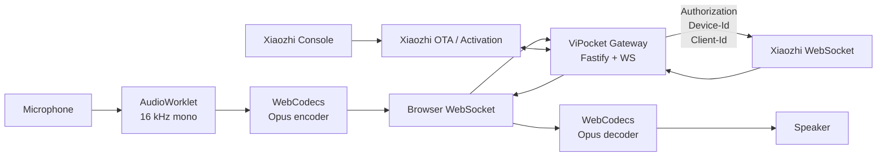

<div align="center">

# 🌐 ViPocket-Xiaozhi

### A bilingual, local-first browser voice client with a secure gateway for the Xiaozhi WebSocket protocol

[](./package.json)
[](./package.json)
[](./LICENSE)
[](./docs/PROTOCOL.md)

**[Tiếng Việt](./README.md) · [English](./README.en.md)**

</div>

---

## 1. What is ViPocket-Xiaozhi?

**ViPocket-Xiaozhi** is an open-source workspace with two cooperating applications:

1. A **Web Voice Client** for modern Edge/Chrome browsers. It handles real activation, microphone capture through AudioWorklet, Opus encode/decode through WebCodecs, Xiaozhi conversation events and barge-in.
2. A **Local Security Gateway** built with Node.js. It keeps upstream tokens server-side, calls the OTA/activation endpoint and proxies WebSocket traffic with authentication headers that browser JavaScript cannot set.

Version 2.0 upgrades the original UI prototype into a serious development platform:

| Capability | Target | Implemented scope |
|---|---:|---|
| Prototype UI | **8/10** | Responsive bilingual interface, three-step wizard, diagnostics and event log |
| Real Xiaozhi connection | **8/10** | OTA activation, stable device identity, single-use tickets and authenticated WebSocket proxy |
| Complete voice client | **8/10** | AudioWorklet, WebCodecs Opus, PTT, STT/LLM/TTS events, playback and barge-in |

> **No fake verification codes.** ViPocket only displays activation codes returned by the configured OTA/Xiaozhi endpoint. Missing upstream configuration produces an explicit error instead of a random six-digit number.

---

## 2. Why a gateway is required

Browser applications cannot safely or reliably provide the full device behavior by themselves:

- The browser WebSocket API does not allow arbitrary handshake headers such as `Authorization`, `Protocol-Version`, `Device-Id` and `Client-Id`.
- Xiaozhi access tokens must not be embedded in HTML, JavaScript or local storage.
- Device activation requires stable identity, an OTA request and later polling after the user enters the verification code in the Console.



---

## 3. Main features

### Real activation

- Stable browser `Device-Id` and `Client-Id`.
- OTA requests with device-compatible headers.
- Verification code comes exclusively from `activation.code` returned upstream.
- Automatic polling until WebSocket configuration becomes available.
- Optional fixed WebSocket/token mode for self-hosted deployments.

### Real-time audio

- `getUserMedia()` with echo cancellation, noise suppression and AGC.
- Audio processing in `AudioWorklet` rather than the UI thread.
- Low-latency resampling to 16 kHz mono and 60 ms frames.
- Opus encoding and decoding with WebCodecs.
- Continuous scheduled playback of incoming audio.
- Pointer, touch and keyboard push-to-talk.

### Conversation protocol

- `hello` handshake and `session_id` tracking.
- `listen/start`, `listen/stop` and `abort`.
- `manual`, `auto` and `realtime` mode fields.
- STT, LLM emotion, TTS state/sentence, alert and MCP message handling.
- User and assistant transcript panels.
- Barge-in that stops local playback and notifies the server.

### Security and operations

- Upstream token never reaches the browser.
- Random short-lived, single-use WebSocket tickets.
- CORS allowlist, rate limiting, request size limits and security headers.
- Automatic redaction for authorization/token fields in logs.
- Loopback binding by default.
- In-memory sessions with predictable expiration.

---

## 4. Repository structure

```text
ViPocket-Xiaozhi/
├─ apps/web/                  # Browser voice client
├─ apps/gateway/              # Activation and WebSocket security gateway
├─ docs/                      # Architecture, protocol, security, deployment
├─ .github/workflows/ci.yml
├─ .env.example
├─ package.json
├─ README.md
├─ README.en.md
└─ LICENSE
```

---

## 5. Requirements

- Node.js 20.11 or newer.
- A recent Edge/Chrome release with Secure Context, AudioWorklet and WebCodecs Opus support.
- An OTA/activation endpoint and Xiaozhi WebSocket service you are authorized to use.
- Microphone access.

Use localhost for development. Use HTTPS/WSS when the browser is not running on the same machine as the gateway.

---

## 6. Quick start

```bash
git clone https://github.com/Base27-CVNSS/ViPocket-Xiaozhi.git
cd ViPocket-Xiaozhi
npm install
cp .env.example .env
# Edit .env and set XIAOZHI_OTA_URL
npm run dev
```

Open `http://127.0.0.1:5173`. The local gateway listens on `http://127.0.0.1:8787` by default.

---

## 7. Gateway configuration

```dotenv
HOST=127.0.0.1
PORT=8787
PUBLIC_ORIGINS=http://localhost:5173,http://127.0.0.1:5173
XIAOZHI_OTA_URL=https://your-server.example/ota/
XIAOZHI_WS_URL=
XIAOZHI_ACCESS_TOKEN=
ACTIVATION_POLL_MS=2500
SESSION_TTL_MS=1800000
TICKET_TTL_MS=60000
```

### Dynamic OTA mode

The OTA endpoint initially returns activation information:

```json
{
  "activation": {
    "code": "668673",
    "message": "Please enter the code",
    "timeout_ms": 300000
  }
}
```

After the device is paired, the same endpoint should provide upstream transport information:

```json
{
  "websocket": {
    "url": "wss://example.org/xiaozhi/v1/",
    "token": "server-issued-token",
    "version": 1
  }
}
```

### Fixed transport mode

Set `XIAOZHI_WS_URL` and `XIAOZHI_ACCESS_TOKEN` when a self-hosted server already manages device registration outside the OTA flow.

---

## 8. User flow

1. Start the web client and gateway.
2. Test the gateway from step one.
3. Request an activation code.
4. Enter the real upstream-issued code in Xiaozhi Console.
5. Wait for polling to detect WebSocket configuration.
6. Open a voice session.
7. Wait for the server `hello` response and `session_id`.
8. Hold the talk button, speak and release it.
9. Incoming Opus packets are decoded and played immediately.
10. Use Interrupt or start speaking to send an abort event.

---

## 9. Gateway API

| Method | Endpoint | Purpose |
|---|---|---|
| `GET` | `/health` | Health and activation configuration |
| `POST` | `/api/v1/activation` | Create a browser-device activation session |
| `GET` | `/api/v1/activation/:id` | Poll activation state |
| `POST` | `/api/v1/activation/:id/ticket` | Issue one single-use WebSocket ticket |
| `DELETE` | `/api/v1/activation/:id` | Remove a session |
| `WS` | `/ws/xiaozhi?ticket=...` | Bidirectional Xiaozhi proxy |

---

## 10. Build and test

```bash
npm test
npm run build
npm run check
```

The production web output is written to `apps/web/dist/`.

---

## 11. Production checklist

- Serve the web application over HTTPS.
- Put the gateway behind a reverse proxy with WebSocket support.
- Store secrets in environment variables or a secret manager.
- Add user authentication before exposing the gateway publicly.
- Replace the in-memory store with Redis for multiple instances.
- Restrict CORS to exact trusted origins.
- Add monitoring, log rotation and upstream failure alerts.

See [docs/DEPLOYMENT.md](./docs/DEPLOYMENT.md).

---

## 12. Current limitations

- WebCodecs Opus support depends on browser version.
- The low-latency resampler is not a studio-grade DSP resampler.
- Restarting the gateway clears in-memory sessions.
- User authentication/OAuth is not included yet.
- MCP messages are surfaced in logs but do not yet have a granular permission UI.
- Binary protocol v2/v3 timestamp wrappers are not implemented.
- Final compatibility depends on the selected Xiaozhi server deployment.

---

## 13. Roadmap

- Redis-backed session storage.
- Audio input/output device selection and diagnostics.
- Binary protocol v2/v3 with timestamps.
- MCP permission center and audit history.
- Local VAD and wake-word support.
- PWA and Tauri desktop packaging.
- Mock Xiaozhi integration tests in CI.
- `turn_id`, `utterance_id`, `audio_pts`, avatar and viseme synchronization.

---

## 14. References and attribution

ViPocket-Xiaozhi is an independent project informed by the public protocol documentation and implementation behavior of:

- [`78/xiaozhi-esp32`](https://github.com/78/xiaozhi-esp32)
- [`docs/websocket.md`](https://github.com/78/xiaozhi-esp32/blob/main/docs/websocket.md)

This repository is not affiliated with `xiaozhi.me`, does not represent upstream authors and does not grant rights to upstream names, logos or hosted services. Deployers remain responsible for applicable licenses, service terms and access rights.

---

## 15. License

Original ViPocket-Xiaozhi code is available under the [MIT License](./LICENSE). Upstream services, protocols, trademarks and source code remain subject to their respective owners and licenses.
