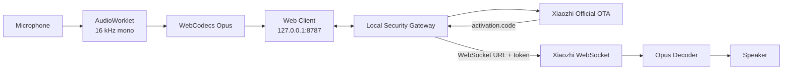
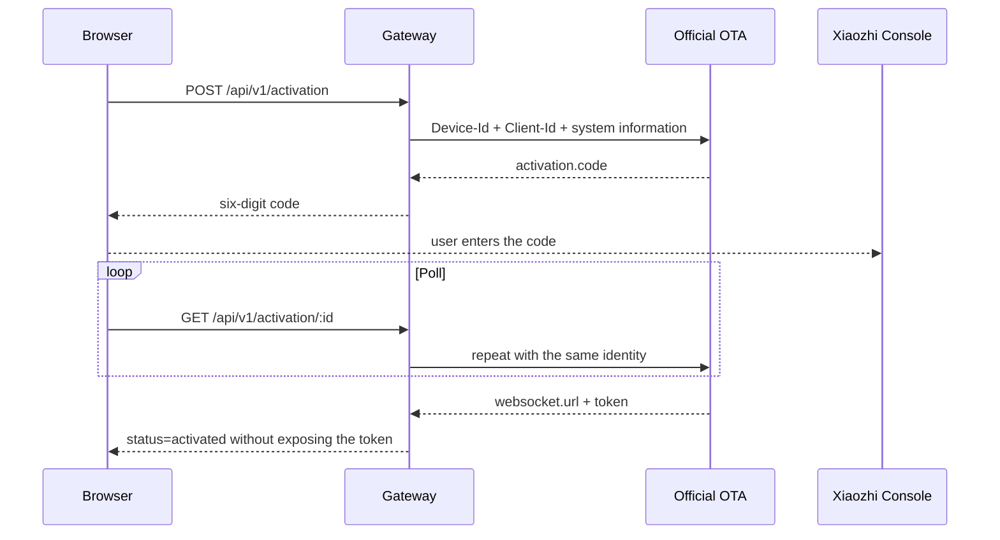
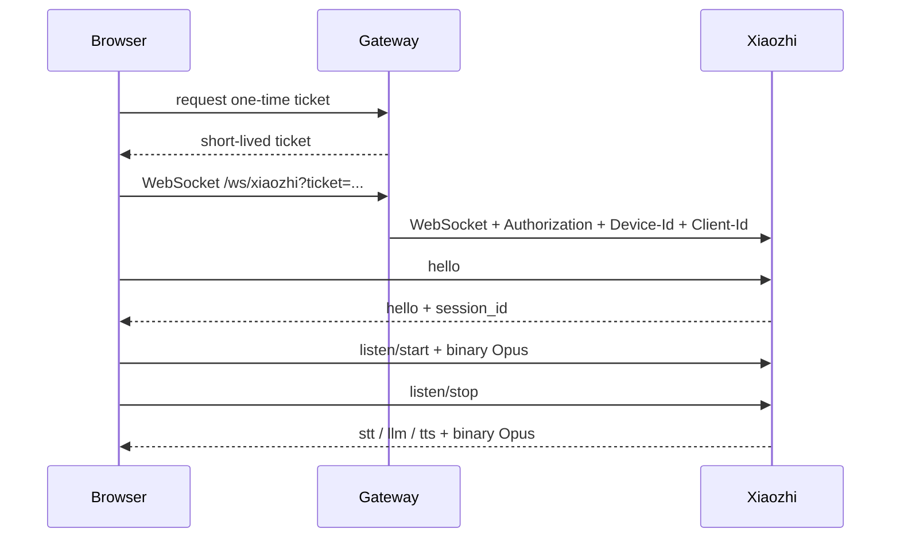

<div align="center">

# 🌐 ViPocket-Xiaozhi 2.3

### Windows Xiaozhi voice client — download, extract, double-click, and request a real activation code

[](https://github.com/Base27-CVNSS/ViPocket-Xiaozhi/releases/download/windows-latest/ViPocket-Xiaozhi-Windows-x64.zip)
[](./package.json)
[](./LICENSE)
[](https://github.com/78/xiaozhi-esp32)

[⬇️ **DOWNLOAD WINDOWS PORTABLE**](https://github.com/Base27-CVNSS/ViPocket-Xiaozhi/releases/download/windows-latest/ViPocket-Xiaozhi-Windows-x64.zip)

**[Tiếng Việt](./README.md) · [English](./README.en.md)**

</div>

---

## One-click Windows start

The Windows Portable package includes a Node.js x64 runtime, WebSocket dependency, production web build, local gateway, and Start/Stop/Repair tools. Users do not need Git, a Node.js installation, or a manual `npm install` command.

```text
1. Download ViPocket-Xiaozhi-Windows-x64.zip.
2. Extract the complete archive.
3. Open the ViPocket-Xiaozhi folder.
4. Double-click START-VIPOCKET.cmd.
5. The browser opens http://127.0.0.1:8787/.
6. Click Request activation code.
7. Enter the real code in Xiaozhi Console.
```

Do not run the application from inside the ZIP. It must be fully extracted so `runtime`, `node_modules`, and the web build remain in the expected structure.

| File | Purpose |
|---|---|
| `START-VIPOCKET.cmd` | Start the website and gateway, then open the browser |
| `STOP-VIPOCKET.cmd` | Stop the owned ViPocket process |
| `REPAIR-VIPOCKET.cmd` | Reinstall and rebuild a source package or damaged files |
| `CONFIGURE-XIAOZHI.cmd` | Configure a custom upstream server only when needed |

```text
Website + Gateway: http://127.0.0.1:8787/
Health check:      http://127.0.0.1:8787/health
WebSocket proxy:   ws://127.0.0.1:8787/ws/xiaozhi
```

---

## What changed in 2.3

### Official Cloud is the zero-configuration default

When no private upstream is configured, the gateway automatically uses the OTA endpoint currently configured by `78/xiaozhi-esp32`:

```text
https://api.tenclass.net/xiaozhi/ota/
```

The previous error:

```text
XIAOZHI_OTA_URL is not configured on the gateway.
```

therefore no longer occurs in the default mode.

### Explicit connection modes

```dotenv
XIAOZHI_MODE=auto
```

| Mode | Behavior |
|---|---|
| `auto` | Prefer fixed WebSocket credentials, then a custom OTA URL, otherwise Official Cloud |
| `official` | Always use the official OTA endpoint |
| `custom` | Require a custom OTA endpoint or fixed WebSocket credentials |
| `offline` | Start the local UI without an upstream service |

### Device-compatible browser identity

ViPocket creates a stable, locally administered unicast MAC address for the browser, for example:

```text
02:11:22:33:44:55
```

Legacy `web-aa:bb:cc:dd:ee:ff` identifiers are migrated automatically. A stale activation session is removed when the identity changes.

### Firmware-compatible OTA request

The gateway sends:

```http
Activation-Version: 1
Device-Id: <stable MAC>
Client-Id: <UUID v4>
Accept-Language: vi-VN
Content-Type: application/json
```

The request body follows the structure emitted by upstream `Board::GetSystemInfoJson()`, including version, language, MAC address, UUID, browser/chip information, application, display, and board metadata.

### Better upstream diagnostics

The activation adapter now distinguishes OTA timeouts, DNS/proxy/firewall failures, non-JSON responses, HTTP errors, and successful responses that contain neither an activation code nor WebSocket configuration.

The WebSocket token returned by OTA remains inside the gateway and is never written to browser local storage.

---

## Architecture



### Activation sequence



### Voice sequence



---

## Advanced configuration

### Force Official Cloud

```dotenv
XIAOZHI_MODE=official
```

### Custom OTA server

```dotenv
XIAOZHI_MODE=custom
XIAOZHI_OTA_URL=https://your-server.example/ota/
```

### Fixed WebSocket transport

```dotenv
XIAOZHI_MODE=custom
XIAOZHI_WS_URL=wss://your-server.example/xiaozhi/v1/
XIAOZHI_ACCESS_TOKEN=your-private-token
```

After editing `.env`, run `STOP-VIPOCKET.cmd` followed by `START-VIPOCKET.cmd`. Never commit a real `.env` or upstream token.

---

## Voice client

- Microphone capture through `getUserMedia()`.
- Echo cancellation, noise suppression, and automatic gain control.
- Audio processing in `AudioWorklet` rather than the UI thread.
- 16 kHz mono resampling and 60 ms frames.
- Opus encoding and decoding through WebCodecs.
- Mouse, touch, Space, and Enter push-to-talk.
- `hello`, `listen`, `abort`, `stt`, `llm`, `tts`, `alert`, and `mcp` handling.
- Barge-in stops local playback and sends `abort` upstream.

---

## Gateway API

| Method | Endpoint | Purpose |
|---|---|---|
| `GET` | `/health` | Website/gateway and activation configuration health |
| `POST` | `/api/v1/activation` | Create a real activation session |
| `GET` | `/api/v1/activation/:id` | Poll pairing state |
| `POST` | `/api/v1/activation/:id/ticket` | Issue a single-use WebSocket ticket |
| `DELETE` | `/api/v1/activation/:id` | Delete a session |
| `WS` | `/ws/xiaozhi?ticket=...` | Proxy JSON and binary frames to upstream |

---

## Verification and release quality gate

GitHub Actions publishes the ZIP only after:

1. JavaScript and PowerShell syntax checks;
2. session and one-time ticket tests;
3. a test proving Official Cloud is the zero-config default;
4. tests for activation headers, payload, activation code, and post-pair WebSocket configuration;
5. the Vite production build;
6. Linux website/gateway smoke tests;
7. a self-contained Windows folder assembly;
8. execution of the exact packaged one-click launcher;
9. `/`, `/health`, and `activationConfigured=true` checks;
10. ZIP creation and `windows-latest` release update.

Protocol tests use deterministic mocked upstream responses so CI remains stable and does not create large numbers of pending devices on the public service.

---

## Troubleshooting

### `ERR_CONNECTION_REFUSED`

Run `STOP-VIPOCKET.cmd`, then `START-VIPOCKET.cmd`. Inspect:

```text
logs\vipocket.log
logs\vipocket-error.log
```

### OTA timeout or unreachable server

Check Internet access, DNS, proxy, VPN, and firewall settings. Official Cloud is an external service and may undergo maintenance or policy changes.

### Console rejects the code

Use only the code just returned by ViPocket 2.3 for the current browser identity. Do not reuse an old, fabricated, or different-device code.

---

## Running from source

```bash
git clone https://github.com/Base27-CVNSS/ViPocket-Xiaozhi.git
cd ViPocket-Xiaozhi
npm install
npm run build
npm start
```

```bash
npm test
npm run check
```

---

## Security and honest boundaries

- The gateway binds to `127.0.0.1` by default.
- Upstream tokens remain in gateway memory.
- WebSocket tickets are short-lived and single-use.
- CORS is restricted to local origins.
- Do not expose the gateway publicly without TLS and user authentication.
- ViPocket can verify its launcher, gateway, request shape, and protocol adapter; it cannot guarantee the uptime or future policy of an external Xiaozhi service.

---

## License and attribution

ViPocket-Xiaozhi is released under the [MIT License](./LICENSE).

This independent project references the protocol and default OTA configuration of [`78/xiaozhi-esp32`](https://github.com/78/xiaozhi-esp32). It is not affiliated with, endorsed by, or operated by `xiaozhi.me`.
