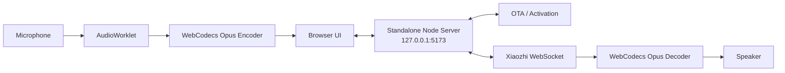

<div align="center">

# 🌐 ViPocket-Xiaozhi 2.2

### One process · One port · Download on Windows and run

[](../../actions)
[](./package.json)
[](./package.json)
[](./LICENSE)

**[Tiếng Việt](./README.md) · [English](./README.en.md)**

</div>

---

## Windows quick start

The Windows artifact includes a portable Node.js runtime, the `ws` production dependency, the web client, and the local gateway.

```text
1. Open GitHub Actions → CI and Windows Portable.
2. Select the latest successful run.
3. Download ViPocket-Xiaozhi-Windows-x64.
4. Extract the complete ZIP.
5. Double-click START-VIPOCKET.cmd.
```

The launcher opens the browser only after the local health check succeeds:

```text
Website + REST API + WebSocket gateway:
http://127.0.0.1:5173

Health API:
http://127.0.0.1:5173/health
```

No Git installation, Node.js installation, Vite server, manual `npm install`, or second terminal is required.

```text
START-VIPOCKET.cmd       Start ViPocket
STOP-VIPOCKET.cmd        Stop the owned process
REPAIR-VIPOCKET.cmd      Reinstall the dependency for a source ZIP
CONFIGURE-XIAOZHI.cmd    Edit upstream Xiaozhi settings
```

---

## Architecture

ViPocket turns Edge or Chrome into a Xiaozhi-compatible voice device. The browser handles the user interface and media pipeline. One local Node.js process handles static files, activation, protected credentials, one-time WebSocket tickets, and the authenticated upstream WebSocket connection.



### Why 2.2 is simpler

The previous layout required two services:

```text
Vite web :5173
Fastify gateway :8787
```

Version 2.2 uses one process and one origin:

```text
Node.js standalone :5173
├─ Static ES-module web client
├─ Health and activation REST API
└─ Authenticated WebSocket proxy
```

The portable production runtime has only one direct dependency:

```json
{
  "ws": "8.18.2"
}
```

Fastify, Zod, dotenv, and Vite are no longer required at runtime.

---

## Real Xiaozhi connection

The local website starts without upstream credentials. Real activation and conversation require an authorized OTA endpoint or WebSocket token.

Double-click `CONFIGURE-XIAOZHI.cmd` and configure one mode.

### Dynamic OTA mode

```dotenv
HOST=127.0.0.1
PORT=5173
XIAOZHI_OTA_URL=https://your-server.example/ota/
```

The endpoint may initially return:

```json
{
  "activation": {
    "code": "668673",
    "message": "Please enter the code",
    "timeout_ms": 300000
  }
}
```

After pairing it should return WebSocket configuration:

```json
{
  "websocket": {
    "url": "wss://your-server.example/xiaozhi/v1/",
    "token": "server-issued-token",
    "version": 1
  }
}
```

### Fixed WebSocket mode

```dotenv
HOST=127.0.0.1
PORT=5173
XIAOZHI_WS_URL=wss://your-server.example/xiaozhi/v1/
XIAOZHI_ACCESS_TOKEN=replace-with-authorized-token
```

After editing `.env`, run `STOP-VIPOCKET.cmd`, then `START-VIPOCKET.cmd`.

ViPocket does not generate fake verification codes and does not expose the upstream token to browser JavaScript.

---

## Voice protocol

Browser to server:

- `hello`
- `listen/start`
- Binary Opus, 16 kHz mono, 60 ms frames
- `listen/stop`
- `abort`

Server to browser:

- `hello` and `session_id`
- `stt`, `llm`, `tts`, `alert`, and `mcp`
- Binary Opus audio

The browser pipeline uses `getUserMedia`, echo cancellation, noise suppression, automatic gain control, AudioWorklet, WebCodecs Opus, push-to-talk, and barge-in.

---

## Local API

| Method | Endpoint | Purpose |
|---|---|---|
| `GET` | `/health` | Check the standalone server |
| `POST` | `/api/v1/activation` | Create an activation session |
| `GET` | `/api/v1/activation/:id` | Poll pairing state |
| `POST` | `/api/v1/activation/:id/ticket` | Issue a one-time WebSocket ticket |
| `DELETE` | `/api/v1/activation/:id` | Delete a session |
| `WS` | `/ws/xiaozhi?ticket=...` | Proxy Xiaozhi JSON and binary frames |

---

## CI and portable packaging

The workflow verifies the project on Ubuntu and Windows. It validates JavaScript and PowerShell syntax, runs unit tests, starts the standalone server, checks `/`, `/health`, and `/src/main.js`, builds the Windows folder with bundled Node.js, runs that assembled folder, and creates the ZIP only after the Windows smoke test passes.

---

## Run from source

```bash
git clone https://github.com/Base27-CVNSS/ViPocket-Xiaozhi.git
cd ViPocket-Xiaozhi
npm install --omit=dev
npm start
```

```bash
npm run check
```

---

## Troubleshooting

For `ERR_CONNECTION_REFUSED`:

```text
STOP-VIPOCKET.cmd
START-VIPOCKET.cmd
```

Inspect:

```text
logs\vipocket.log
```

When port 5173 is occupied, close the other application. The launcher does not terminate an unrelated process.

When the website opens but activation is unavailable, use `CONFIGURE-XIAOZHI.cmd` and provide valid upstream settings.

---

## Security and honest limitations

- The local server binds to `127.0.0.1` by default.
- The upstream token remains in `.env` and server memory.
- WebSocket tickets are random, short-lived, and single-use.
- Request sizes and WebSocket payloads are limited.
- Static paths are validated to prevent traversal.
- The project does not embed a public secret or fake successful pairing.

The portable package guarantees a tested local website and gateway startup. A real Xiaozhi connection still depends on a valid endpoint, valid access rights, upstream policy, browser WebCodecs Opus support, and microphone permission.

---

## License and attribution

Original ViPocket-Xiaozhi code is released under the [MIT License](./LICENSE).

This independent project references the protocol of [`78/xiaozhi-esp32`](https://github.com/78/xiaozhi-esp32). It is not affiliated with or endorsed by `xiaozhi.me` or upstream authors.
