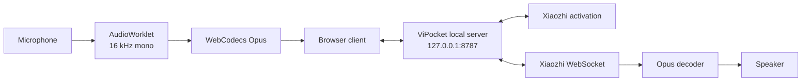
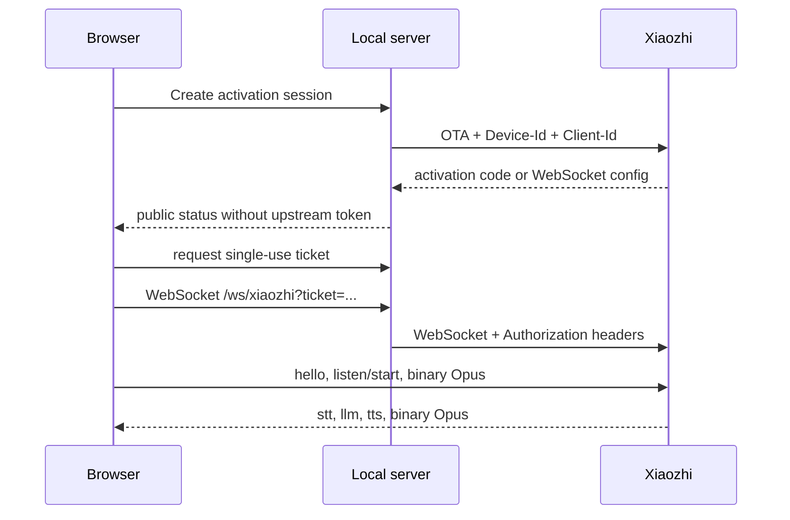

<div align="center">

# 🌐 ViPocket-Xiaozhi 2.2

### Windows Xiaozhi voice client — download, extract, double-click, run

[](https://github.com/Base27-CVNSS/ViPocket-Xiaozhi/releases/download/windows-latest/ViPocket-Xiaozhi-Windows-x64.zip)
[](./package.json)
[](./LICENSE)

[⬇️ **DOWNLOAD WINDOWS PORTABLE**](https://github.com/Base27-CVNSS/ViPocket-Xiaozhi/releases/download/windows-latest/ViPocket-Xiaozhi-Windows-x64.zip)

**[Tiếng Việt](./README.md) · [English](./README.en.md)**

</div>

---

## One-click Windows start

The portable ZIP contains the Node.js x64 runtime, production website, `ws` runtime dependency, local gateway, and all launcher scripts.

```text
1. Download ViPocket-Xiaozhi-Windows-x64.zip.
2. Extract the complete archive.
3. Open the ViPocket-Xiaozhi folder.
4. Double-click START-VIPOCKET.cmd.
5. The browser opens http://127.0.0.1:8787/
```

No Git installation, Node.js installation, or manual `npm install` is required.

| File | Purpose |
|---|---|
| `START-VIPOCKET.cmd` | Start and open ViPocket |
| `STOP-VIPOCKET.cmd` | Stop only the tracked ViPocket process |
| `REPAIR-VIPOCKET.cmd` | Reinstall/build missing source-package files |
| `CONFIGURE-XIAOZHI.cmd` | Edit real Xiaozhi upstream settings |

```text
Website + gateway: http://127.0.0.1:8787/
Health endpoint:   http://127.0.0.1:8787/health
WebSocket proxy:   ws://127.0.0.1:8787/ws/xiaozhi
```

Version 2.2 uses one process and one port for the production website, REST activation API, and WebSocket proxy. This removes the earlier partial-start condition where port `5173` or `8787` could be unavailable independently.

---

## Architecture



The local server uses built-in Node.js HTTP APIs plus the `ws` package. It serves static assets, activation REST endpoints, health checks, and the authenticated Xiaozhi WebSocket proxy.

---

## Why 2.2 is more reliable

- One local process and one port.
- Only one production runtime dependency: `ws`.
- No Vite development server in the portable package.
- Launcher health-checks `/` and `/health` before opening the browser.
- Correct WASM MIME type and safe SPA fallback.
- Path traversal protection and explicit loopback CORS allowlist.
- Windows CI boots the assembled folder before creating the ZIP.
- A stable `windows-latest` release asset is overwritten only after successful verification.

---

## Connecting to a real Xiaozhi server

The local website starts immediately. Real pairing and voice communication require an authorized upstream endpoint or token.

Double-click `CONFIGURE-XIAOZHI.cmd`, then configure either:

```dotenv
XIAOZHI_OTA_URL=https://your-server.example/ota/
```

or:

```dotenv
XIAOZHI_WS_URL=wss://your-server.example/xiaozhi/v1/
XIAOZHI_ACCESS_TOKEN=replace-with-valid-token
```

After saving `.env`, run `STOP-VIPOCKET.cmd`, then `START-VIPOCKET.cmd`.

ViPocket never invents a random activation code. It only exposes `activation.code` received from the configured upstream.

---

## Protocol flow



---

## Troubleshooting

For `ERR_CONNECTION_REFUSED`:

```text
STOP-VIPOCKET.cmd
START-VIPOCKET.cmd
```

Then check:

```text
http://127.0.0.1:8787/health
logs\vipocket.log
```

Do not run the application inside the ZIP viewer. Extract the entire folder first.

---

## Running from source

```bash
git clone https://github.com/Base27-CVNSS/ViPocket-Xiaozhi.git
cd ViPocket-Xiaozhi
npm install
npm run build
npm start
```

Open `http://127.0.0.1:8787/`.

---

## Honest limitations

The portable package guarantees that the local website and local gateway can start without development tools. Successful upstream communication still depends on a valid endpoint, token, server policy, browser WebCodecs Opus support, and microphone permission.

## License and attribution

Original ViPocket-Xiaozhi code is released under the [MIT License](./LICENSE). This independent project references the public protocol of [`78/xiaozhi-esp32`](https://github.com/78/xiaozhi-esp32) and is not affiliated with `xiaozhi.me`.
