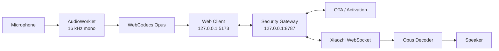
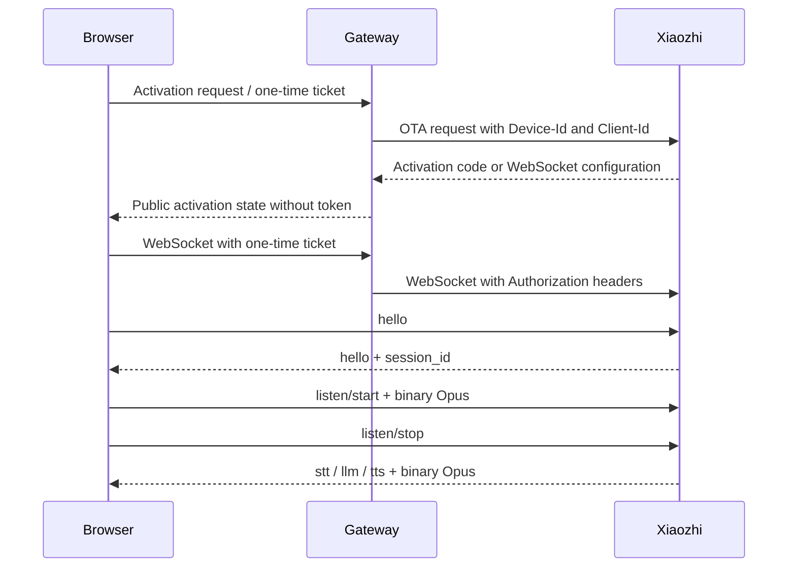

<div align="center">

# 🌐 ViPocket-Xiaozhi 2.1

### Download on Windows, extract, double-click, and run

[](../../actions)
[](./package.json)
[](./LICENSE)
[](./docs/PROTOCOL.md)

**[Tiếng Việt](./README.md) · [English](./README.en.md)**

</div>

---

## Windows quick start

The **Windows Portable** artifact already contains:

- A portable Node.js runtime.
- Production gateway dependencies.
- The prebuilt web application.
- Start, stop, repair, and configuration launchers.

No Git installation, Node.js installation, or manual `npm install` command is required.

```text
1. Download ViPocket-Xiaozhi-Windows-x64.zip from GitHub Actions.
2. Extract the full archive.
3. Double-click START-VIPOCKET.cmd.
4. Wait for http://127.0.0.1:5173 to open.
```

Windows commands:

```text
START-VIPOCKET.cmd       Start website and gateway
STOP-VIPOCKET.cmd        Stop the complete process tree
REPAIR-VIPOCKET.cmd      Reinstall/rebuild a damaged source package
CONFIGURE-XIAOZHI.cmd    Edit real Xiaozhi connection settings
```

```text
Website:         http://127.0.0.1:5173
Gateway health:  http://127.0.0.1:8787/health
```

Port `8787` is the gateway API, not the user interface. The launcher opens the browser only after both local services pass health checks.

---

## Architecture

ViPocket-Xiaozhi is a browser voice client plus a local security gateway. The gateway protects upstream credentials and supplies WebSocket handshake headers that browser JavaScript cannot set.



| Capability | Target | Scope |
|---|---:|---|
| Prototype UI | **8/10** | Responsive bilingual wizard, transcript and diagnostics |
| Real Xiaozhi connection | **8/10** | OTA activation, device identity, protected token and WebSocket proxy |
| Voice client | **8/10** | AudioWorklet, WebCodecs Opus, PTT, STT/LLM/TTS and barge-in |
| Windows experience | **9/10** | Bundled runtime, health checks, auto-open, stop/repair/configure tools |

---

## What changed in 2.1

### True portable package

The Windows workflow packages `runtime/`, production `node_modules/`, and `apps/web/dist/`. The downloaded artifact does not need a Vite development server or a first-run dependency installation.

### Production runner

`scripts/portable-runner.mjs`:

- Serves the production web build on port `5173`.
- Starts the gateway as a managed child process on port `8787`.
- Sends the correct WASM MIME type.
- Supports SPA fallback.
- Prevents path traversal.
- Uses immutable caching for hashed assets and no-store for `index.html`.
- Shuts down the gateway with the parent runner.

### Self-healing launcher

The Windows launcher:

- Prefers the bundled runtime.
- Falls back to a suitable system Node.js.
- Downloads a portable current LTS runtime for a source ZIP when necessary.
- Installs/builds only when production files are missing.
- Detects port conflicts.
- Writes `logs/vipocket.log`.
- Tracks and terminates the full process tree.

### No fake pairing code

ViPocket displays only `activation.code` returned by the configured OTA/Xiaozhi endpoint. It never generates a random six-digit number and presents it as a valid upstream pairing code.

---

## Connecting to a real Xiaozhi server

The local website and gateway start immediately. A real upstream connection still requires an endpoint/token that the deployer is authorized to use.

Double-click:

```text
CONFIGURE-XIAOZHI.cmd
```

### Dynamic OTA mode

```dotenv
XIAOZHI_OTA_URL=https://your-server.example/ota/
```

Initial response:

```json
{
  "activation": {
    "code": "668673",
    "message": "Please enter the code",
    "timeout_ms": 300000
  }
}
```

Activated response:

```json
{
  "websocket": {
    "url": "wss://your-server.example/xiaozhi/v1/",
    "token": "server-issued-token",
    "version": 1
  }
}
```

### Fixed WebSocket mode

```dotenv
XIAOZHI_WS_URL=wss://your-server.example/xiaozhi/v1/
XIAOZHI_ACCESS_TOKEN=replace-with-server-side-token
```

After saving `.env`, run `STOP-VIPOCKET.cmd`, then `START-VIPOCKET.cmd`.

Never commit a real `.env` or upstream token.

---

## Voice flow



---

## Gateway API

| Method | Endpoint | Purpose |
|---|---|---|
| `GET` | `/health` | Gateway health and configuration state |
| `POST` | `/api/v1/activation` | Create an activation session |
| `GET` | `/api/v1/activation/:id` | Poll pairing state |
| `POST` | `/api/v1/activation/:id/ticket` | Issue a one-time WebSocket ticket |
| `DELETE` | `/api/v1/activation/:id` | Delete a session |
| `WS` | `/ws/xiaozhi?ticket=...` | Proxy JSON and binary frames |

---

## Running from source

```bash
git clone https://github.com/Base27-CVNSS/ViPocket-Xiaozhi.git
cd ViPocket-Xiaozhi
npm install
npm run build
npm start
```

Development mode:

```bash
npm run dev
```

Tests:

```bash
npm test
npm run check
```

---

## Windows troubleshooting

### `ERR_CONNECTION_REFUSED`

Run:

```text
STOP-VIPOCKET.cmd
START-VIPOCKET.cmd
```

Then inspect:

```text
logs\vipocket.log
```

### Missing source dependencies

Run:

```text
REPAIR-VIPOCKET.cmd
```

### Gateway online but activation unavailable

Run `CONFIGURE-XIAOZHI.cmd` and supply a valid authorized endpoint/token. The launcher cannot manufacture upstream access rights.

---

## Security

- The gateway binds to `127.0.0.1` by default.
- Upstream tokens stay in `.env` and gateway memory.
- Loopback origins are explicitly allowlisted.
- WebSocket tickets are random, short-lived, and single-use.
- Logs redact authorization/token fields.
- Do not expose the gateway publicly without TLS and user authentication.

Documentation:

- [Architecture](./docs/ARCHITECTURE.md)
- [Protocol](./docs/PROTOCOL.md)
- [Security](./docs/SECURITY.md)
- [Deployment](./docs/DEPLOYMENT.md)

---

## Honest limitations

The Windows Portable package guarantees that the **local website and local gateway can start without development tools**. Successful communication with a specific Xiaozhi deployment still depends on:

- A valid OTA/WebSocket endpoint.
- A valid token and access rights.
- Upstream server policy.
- Browser WebCodecs Opus support and microphone permission.

The project does not embed a public secret or fake a successful pairing state.

---

## License and attribution

Original ViPocket-Xiaozhi code is released under the [MIT License](./LICENSE).

This is an independent project informed by the protocol of [`78/xiaozhi-esp32`](https://github.com/78/xiaozhi-esp32). It is not affiliated with or endorsed by `xiaozhi.me` or upstream authors.
