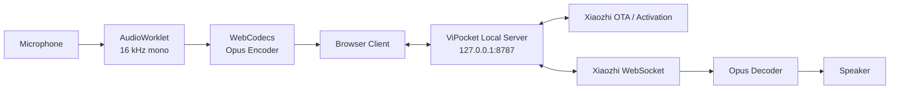
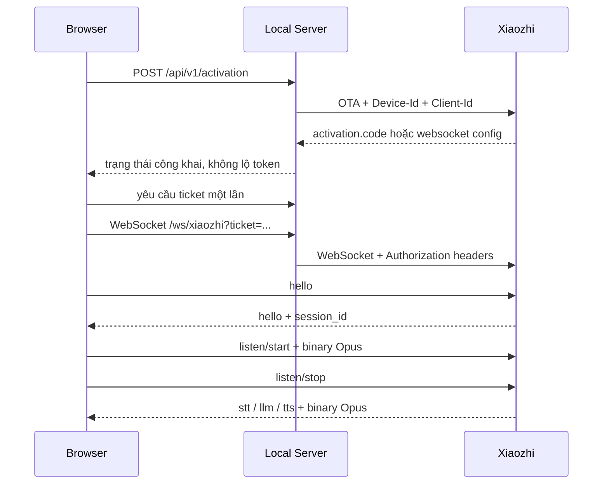

<div align="center">

# 🇻🇳 ViPocket-Xiaozhi 2.2

### Client thoại Xiaozhi cho Windows — tải ZIP, giải nén, nhấp đúp và chạy

[](https://github.com/Base27-CVNSS/ViPocket-Xiaozhi/releases/download/windows-latest/ViPocket-Xiaozhi-Windows-x64.zip)
[](./package.json)
[](./LICENSE)
[](./docs/PROTOCOL.md)

[⬇️ **TẢI WINDOWS PORTABLE**](https://github.com/Base27-CVNSS/ViPocket-Xiaozhi/releases/download/windows-latest/ViPocket-Xiaozhi-Windows-x64.zip)

**[Tiếng Việt](./README.md) · [English](./README.en.md)**

</div>

---

## ⚡ Chạy một phát trên Windows

Bản Windows Portable chứa sẵn:

- Node.js runtime x64.
- Dependency WebSocket cần thiết.
- Website production đã build.
- Gateway kích hoạt và chuyển tiếp Xiaozhi.
- Bộ lệnh Start, Stop, Repair và Configure.

Không cần cài Git, Node.js hoặc gõ `npm install`.

```text
1. Tải ViPocket-Xiaozhi-Windows-x64.zip.
2. Giải nén toàn bộ ZIP.
3. Mở thư mục ViPocket-Xiaozhi.
4. Nhấp đúp START-VIPOCKET.cmd.
5. Trình duyệt tự mở http://127.0.0.1:8787/
```

> Không chạy trực tiếp bên trong ZIP. Windows cần giải nén đầy đủ để runtime, `node_modules` và website nằm đúng cấu trúc.

### Các lệnh đi kèm

| Tệp | Chức năng |
|---|---|
| `START-VIPOCKET.cmd` | Khởi động và tự mở website |
| `STOP-VIPOCKET.cmd` | Dừng đúng tiến trình ViPocket |
| `REPAIR-VIPOCKET.cmd` | Cài/build lại khi dùng source ZIP hoặc file bị thiếu |
| `CONFIGURE-XIAOZHI.cmd` | Mở `.env` để cấu hình máy chủ Xiaozhi |

### Một địa chỉ duy nhất

```text
Website + Gateway: http://127.0.0.1:8787/
Health check:      http://127.0.0.1:8787/health
WebSocket proxy:   ws://127.0.0.1:8787/ws/xiaozhi
```

Phiên bản 2.2 bỏ mô hình Vite `5173` + gateway `8787` trong bản chạy thực tế. Website, REST API và WebSocket proxy được phục vụ bởi **một tiến trình, một cổng**, giảm lỗi `ERR_CONNECTION_REFUSED` và sai địa chỉ.

---

## Kiến trúc



### Các lớp logic

| Lớp | Trách nhiệm |
|---|---|
| Web UI | Thiết lập, kích hoạt, transcript, PTT, ngắt lời và chẩn đoán |
| AudioWorklet | Thu micro ngoài UI thread, resample 16 kHz và tạo frame 60 ms |
| WebCodecs | Mã hóa/giải mã Opus trong trình duyệt |
| Local Server | Phục vụ website, REST activation và WebSocket proxy |
| Session Store | Phiên kích hoạt, TTL và ticket WebSocket dùng một lần |
| Activation Adapter | Gọi OTA bằng `Device-Id`, `Client-Id`, `Activation-Version` |
| Xiaozhi Proxy | Gắn `Authorization`, `Protocol-Version` và chuyển tiếp text/binary |

---

## Vì sao 2.2 ổn định hơn?

### 1. Loại bỏ chuỗi dependency gateway phức tạp

Gateway chỉ còn dependency runtime `ws`. REST, static server, CORS allowlist, security headers, giới hạn body và rate limit dùng trực tiếp API chuẩn của Node.js.

### 2. Một tiến trình duy nhất

`START-VIPOCKET.cmd` chạy:

```text
runtime\node.exe apps\gateway\src\index.mjs
```

Tiến trình này đồng thời phục vụ website và gateway. Không còn trường hợp Vite chạy nhưng gateway chết, hoặc gateway chạy nhưng cổng website chưa mở.

### 3. Health check trước khi mở trình duyệt

Launcher chỉ mở website sau khi xác nhận:

- Trang `/` trả HTTP 200 và có nội dung ViPocket.
- `/health` trả `ok: true`.
- Tiến trình vẫn còn hoạt động.

### 4. CI kiểm tra chính ZIP Windows

Workflow thực hiện:

1. Kiểm tra cú pháp JavaScript và PowerShell.
2. Chạy unit test.
3. Build website production.
4. Smoke-test trên Ubuntu.
5. Đóng gói Node.js runtime + `ws` + web build.
6. Chạy thử thư mục Windows vừa đóng gói.
7. Chỉ tạo ZIP khi website và health check đều thành công.
8. Cập nhật asset ổn định trong release `windows-latest`.

---

## Kết nối Xiaozhi thật

Website local chạy ngay mà không cần cấu hình. Để kích hoạt và hội thoại với một máy chủ Xiaozhi thật, nhấp đúp:

```text
CONFIGURE-XIAOZHI.cmd
```

### Phương án A — OTA activation

```dotenv
XIAOZHI_OTA_URL=https://your-server.example/ota/
```

Gateway chỉ hiển thị mã thật từ:

```json
{
  "activation": {
    "code": "668673",
    "message": "Please enter the code",
    "timeout_ms": 300000
  }
}
```

Sau khi liên kết, OTA cần trả cấu hình WebSocket:

```json
{
  "websocket": {
    "url": "wss://your-server.example/xiaozhi/v1/",
    "token": "server-issued-token",
    "version": 1
  }
}
```

### Phương án B — WebSocket cố định

```dotenv
XIAOZHI_WS_URL=wss://your-server.example/xiaozhi/v1/
XIAOZHI_ACCESS_TOKEN=replace-with-valid-token
```

Sau khi lưu `.env`, chạy:

```text
STOP-VIPOCKET.cmd
START-VIPOCKET.cmd
```

ViPocket không nhúng token công khai và không tạo mã pairing ngẫu nhiên giả.

---

## Giao thức hội thoại



---

## Xử lý lỗi Windows

### `ERR_CONNECTION_REFUSED`

```text
STOP-VIPOCKET.cmd
START-VIPOCKET.cmd
```

Sau đó kiểm tra:

```text
http://127.0.0.1:8787/health
```

### Xem nguyên nhân chi tiết

```text
logs\vipocket.log
```

### Thiếu runtime hoặc dependency

Tải lại bản Windows Portable. Khi đang dùng source ZIP, có thể chạy:

```text
REPAIR-VIPOCKET.cmd
```

### Cổng 8787 bị chiếm

Đóng ứng dụng đang dùng cổng đó, hoặc chạy `STOP-VIPOCKET.cmd` nếu đó là phiên ViPocket cũ. Script dừng kiểm tra đường dẫn tiến trình trước khi `taskkill`, tránh tắt nhầm ứng dụng khác.

---

## Chạy từ mã nguồn

```bash
git clone https://github.com/Base27-CVNSS/ViPocket-Xiaozhi.git
cd ViPocket-Xiaozhi
npm install
npm run build
npm start
```

Mở:

```text
http://127.0.0.1:8787/
```

Phát triển với Vite hot reload:

```bash
npm run dev
```

---

## Bảo mật

- Mặc định chỉ bind `127.0.0.1`.
- Token upstream chỉ nằm trong `.env` và bộ nhớ server.
- Ticket WebSocket ngẫu nhiên, TTL ngắn và chỉ dùng một lần.
- Giới hạn body, payload WebSocket và tần suất activation/ticket.
- CORS chỉ chấp nhận origin loopback đã cấu hình.
- Không ghi token vào log.
- Static server chặn path traversal và gửi MIME `application/wasm` đúng chuẩn.

---

## Giới hạn trung thực

Bản Portable bảo đảm **website và local gateway tự chạy mà không cần công cụ phát triển**. Việc kết nối thành công với upstream vẫn cần:

- Endpoint OTA hoặc WebSocket hợp lệ.
- Token/quyền truy cập hợp lệ.
- Máy chủ tương thích giao thức Xiaozhi.
- Edge/Chrome hỗ trợ AudioWorklet và WebCodecs Opus.
- Quyền microphone.

---

## Tài liệu

- [Kiến trúc](./docs/ARCHITECTURE.md)
- [Giao thức](./docs/PROTOCOL.md)
- [Bảo mật](./docs/SECURITY.md)
- [Triển khai](./docs/DEPLOYMENT.md)

## Giấy phép và ghi công

Mã nguồn ViPocket-Xiaozhi phát hành theo [MIT License](./LICENSE). Dự án độc lập, tham chiếu giao thức của [`78/xiaozhi-esp32`](https://github.com/78/xiaozhi-esp32), không đại diện cho `xiaozhi.me` hoặc tác giả upstream.
