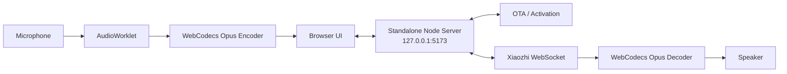
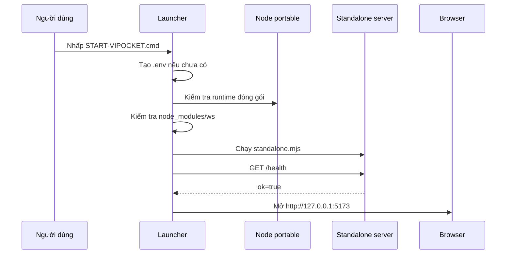

<div align="center">

# 🇻🇳 ViPocket-Xiaozhi 2.2

### Một tiến trình · Một cổng · Tải về Windows và chạy ngay

[](../../actions)
[](./package.json)
[](./package.json)
[](./LICENSE)

**[Tiếng Việt](./README.md) · [English](./README.en.md)**

</div>

---

## ⚡ Chạy trên Windows

Bản artifact Windows được đóng gói sẵn với Node.js portable, dependency `ws`, giao diện web và gateway.

```text
1. Mở GitHub Actions → CI and Windows Portable.
2. Chọn lần chạy mới nhất có dấu xanh.
3. Tải artifact ViPocket-Xiaozhi-Windows-x64.
4. Giải nén toàn bộ ZIP.
5. Nhấp đúp START-VIPOCKET.cmd.
```

Trình duyệt chỉ được mở sau khi health check thành công:

```text
Website + API + WebSocket gateway:
http://127.0.0.1:5173

Health API:
http://127.0.0.1:5173/health
```

Không cần:

- Git.
- Cài Node.js.
- Gõ `npm install`.
- Chạy Vite.
- Mở đồng thời hai terminal hoặc hai cổng.

### Các tệp điều khiển Windows

```text
START-VIPOCKET.cmd       Khởi động hệ thống
STOP-VIPOCKET.cmd        Dừng đúng tiến trình ViPocket
REPAIR-VIPOCKET.cmd      Cài lại dependency khi dùng source ZIP
CONFIGURE-XIAOZHI.cmd    Mở .env để cấu hình upstream
```

---

## ViPocket-Xiaozhi là gì?

ViPocket-Xiaozhi biến Edge/Chrome thành một thiết bị thoại tương thích giao thức Xiaozhi. Trình duyệt phụ trách giao diện và âm thanh; tiến trình Node.js cục bộ phụ trách:

- Phục vụ website.
- Gọi OTA/activation API.
- Giữ token ngoài JavaScript phía trình duyệt.
- Cấp ticket WebSocket dùng một lần.
- Mở WebSocket upstream với `Authorization`, `Protocol-Version`, `Device-Id`, `Client-Id`.
- Chuyển tiếp JSON và binary Opus hai chiều.



---

## Vì sao phiên bản 2.2 ổn định hơn?

Phiên bản cũ có hai dịch vụ độc lập:

```text
Vite web :5173
Fastify gateway :8787
```

Điều đó tạo nhiều điểm lỗi:

- Một dịch vụ chạy nhưng dịch vụ còn lại chưa chạy.
- Người dùng mở nhầm cổng `8787`.
- CORS giữa hai origin.
- Hai tiến trình và hai health check.
- Vite/Fastify/plugin làm tăng dependency và rủi ro CI.
- Artifact có thể thiếu `dist`, runtime hoặc `node_modules`.

Phiên bản 2.2 thay bằng:

```text
Node.js standalone :5173
├─ Static web
├─ REST activation API
├─ Health API
└─ WebSocket proxy
```

Runtime production chỉ còn dependency trực tiếp:

```json
{
  "ws": "8.18.2"
}
```

Không còn phụ thuộc runtime vào Fastify, Zod, dotenv hoặc Vite.

---

## Luồng khởi động Windows



Launcher ưu tiên theo thứ tự:

1. `runtime/node.exe` trong artifact.
2. Runtime portable đã tải trước đó.
3. Node.js hệ thống từ 20.11 trở lên.
4. Tự tải Node.js LTS portable từ nodejs.org khi chạy source ZIP.

Bản artifact chuẩn không cần bước tải hoặc cài đặt nào ở lần chạy đầu.

---

## Kích hoạt Xiaozhi thật

Website local chạy được ngay cả khi chưa có upstream. Để nhận mã activation thật và trò chuyện, cần endpoint hoặc token hợp lệ mà người dùng có quyền sử dụng.

Mở:

```text
CONFIGURE-XIAOZHI.cmd
```

### Chế độ OTA động

```dotenv
HOST=127.0.0.1
PORT=5173
XIAOZHI_OTA_URL=https://your-server.example/ota/
```

Endpoint OTA có thể trả:

```json
{
  "activation": {
    "code": "668673",
    "message": "Please enter the code",
    "timeout_ms": 300000
  }
}
```

Sau khi liên kết:

```json
{
  "websocket": {
    "url": "wss://your-server.example/xiaozhi/v1/",
    "token": "server-issued-token",
    "version": 1
  }
}
```

### Chế độ WebSocket cố định

```dotenv
HOST=127.0.0.1
PORT=5173
XIAOZHI_WS_URL=wss://your-server.example/xiaozhi/v1/
XIAOZHI_ACCESS_TOKEN=replace-with-authorized-token
```

Sau khi sửa `.env`:

```text
STOP-VIPOCKET.cmd
START-VIPOCKET.cmd
```

> ViPocket không tự sinh mã xác minh giả và không nhúng token công khai vào mã frontend.

---

## Giao thức thoại

### Browser → server

- `hello`
- `listen/start`
- Binary Opus 16 kHz mono, frame 60 ms
- `listen/stop`
- `abort`

### Server → browser

- `hello` và `session_id`
- `stt`
- `llm`
- `tts/start`
- `tts/sentence_start`
- Binary Opus
- `tts/stop`
- `alert`
- `mcp`

Browser sử dụng:

- `getUserMedia()`.
- Echo cancellation.
- Noise suppression.
- Auto gain control.
- `AudioWorklet`.
- WebCodecs `AudioEncoder` và `AudioDecoder`.
- Push-to-talk và barge-in.

---

## API cục bộ

| Phương thức | Endpoint | Chức năng |
|---|---|---|
| `GET` | `/health` | Kiểm tra standalone server |
| `POST` | `/api/v1/activation` | Tạo phiên activation |
| `GET` | `/api/v1/activation/:id` | Poll trạng thái |
| `POST` | `/api/v1/activation/:id/ticket` | Cấp ticket WebSocket một lần |
| `DELETE` | `/api/v1/activation/:id` | Xóa phiên |
| `WS` | `/ws/xiaozhi?ticket=...` | Proxy giao thức Xiaozhi |

---

## CI/CD

Workflow thực hiện tuần tự:

### Ubuntu verification

1. Cài dependency production.
2. Kiểm tra cú pháp Node.js.
3. Chạy unit test.
4. Khởi động standalone server.
5. Kiểm tra `/`, `/health`, `/src/main.js`.

### Windows portable

1. Kiểm tra cú pháp PowerShell launcher.
2. Chạy test trên Windows.
3. Sao chép mã nguồn và dependency production.
4. Tải Node.js x64 portable.
5. Chạy chính thư mục đã đóng gói.
6. Kiểm tra website và health API.
7. Chỉ tạo ZIP khi smoke test đạt.
8. Upload `ViPocket-Xiaozhi-Windows-x64.zip`.

---

## Chạy từ mã nguồn

```bash
git clone https://github.com/Base27-CVNSS/ViPocket-Xiaozhi.git
cd ViPocket-Xiaozhi
npm install --omit=dev
npm start
```

Chế độ theo dõi thay đổi:

```bash
npm run dev
```

Kiểm tra:

```bash
npm run check
```

---

## Xử lý lỗi

### `ERR_CONNECTION_REFUSED`

```text
STOP-VIPOCKET.cmd
START-VIPOCKET.cmd
```

Xem log:

```text
logs\vipocket.log
```

### Cổng 5173 đang được sử dụng

Đóng ứng dụng đang chiếm cổng hoặc chạy `STOP-VIPOCKET.cmd`. Launcher không tự ý dừng tiến trình không thuộc thư mục ViPocket.

### Website mở nhưng không nhận mã activation

Local server đã chạy, nhưng `.env` chưa có upstream hợp lệ. Chạy `CONFIGURE-XIAOZHI.cmd`.

### Source ZIP thiếu dependency

```text
REPAIR-VIPOCKET.cmd
```

Bản artifact Windows chuẩn đã chứa `node_modules/ws`, nên không cần repair.

---

## Bảo mật

- Chỉ bind `127.0.0.1` theo mặc định.
- Token không được trả về browser.
- Ticket WebSocket ngẫu nhiên, ngắn hạn và dùng một lần.
- Giới hạn kích thước request và WebSocket payload.
- Rate limit cục bộ cho API.
- Chặn path traversal khi phục vụ file.
- MIME `application/wasm` được hỗ trợ.
- `index.html` không cache; asset dùng cache ngắn có kiểm soát.

Không mở server ra Internet khi chưa có TLS, đăng nhập và phân quyền người dùng.

---

## Cấu trúc chính

```text
ViPocket-Xiaozhi/
├─ apps/
│  ├─ web/
│  │  ├─ index.html
│  │  └─ src/
│  └─ gateway/
│     ├─ src/
│     │  ├─ standalone.mjs
│     │  ├─ activation-service.mjs
│     │  └─ session-store.mjs
│     └─ test/
├─ scripts/
│  ├─ windows-one-click.ps1
│  └─ windows-stop.ps1
├─ .github/workflows/ci.yml
├─ START-VIPOCKET.cmd
├─ STOP-VIPOCKET.cmd
├─ REPAIR-VIPOCKET.cmd
├─ CONFIGURE-XIAOZHI.cmd
├─ .env.example
└─ package.json
```

---

## Giới hạn trung thực

Bản Portable bảo đảm website và gateway local được khởi động và kiểm thử trước khi ZIP được xuất bản. Kết nối đến dịch vụ Xiaozhi cụ thể vẫn phụ thuộc vào:

- Endpoint hợp lệ.
- Token/quyền truy cập hợp lệ.
- Chính sách upstream.
- WebCodecs Opus trên trình duyệt.
- Quyền microphone.

---

## Giấy phép và ghi công

Mã nguồn ViPocket-Xiaozhi được phát hành theo [MIT License](./LICENSE).

Dự án độc lập, tham chiếu giao thức từ [`78/xiaozhi-esp32`](https://github.com/78/xiaozhi-esp32), không thuộc và không đại diện cho `xiaozhi.me` hay tác giả upstream.
