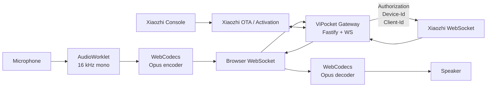
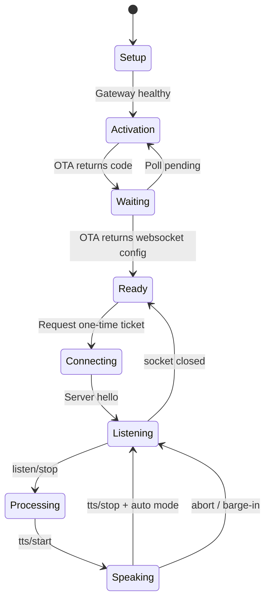

<div align="center">

# 🇻🇳 ViPocket-Xiaozhi

### Trình khách thoại Xiaozhi chạy trên trình duyệt, song ngữ Việt–Anh, local-first và bảo vệ token bằng gateway riêng

[](./package.json)
[](./package.json)
[](./LICENSE)
[](./docs/PROTOCOL.md)

**[Tiếng Việt](./README.md) · [English](./README.en.md)**

</div>

---

## 1. ViPocket-Xiaozhi là gì?

**ViPocket-Xiaozhi** là một bộ mã nguồn mở gồm hai thành phần:

1. **Web Voice Client** chạy trên Edge/Chrome, quản lý kích hoạt thiết bị, thu âm bằng `AudioWorklet`, mã hóa/giải mã Opus bằng WebCodecs, hiển thị STT/TTS và hỗ trợ ngắt lời.
2. **Local Security Gateway** chạy bằng Node.js, giữ token Xiaozhi ở phía máy chủ, gọi endpoint OTA/kích hoạt và chuyển tiếp WebSocket với các header mà trình duyệt không thể tự đặt.

Mục tiêu của phiên bản 2.0 là đưa dự án từ một trang giao diện mô phỏng thành một nền tảng thử nghiệm nghiêm túc:

| Năng lực | Mức mục tiêu | Nội dung đã triển khai |
|---|---:|---|
| Prototype UI | **8/10** | UI responsive, song ngữ, trình hướng dẫn 3 bước, chẩn đoán và nhật ký sự kiện |
| Kết nối Xiaozhi thật | **8/10** | OTA activation, Device-Id/Client-Id, ticket một lần, WebSocket proxy có header xác thực |
| Client thoại hoàn chỉnh | **8/10** | AudioWorklet, Opus WebCodecs, PTT, STT/LLM/TTS events, phát âm thanh và barge-in |

> **Không còn mã kích hoạt giả.** ViPocket chỉ hiển thị mã do endpoint OTA/Xiaozhi đã cấu hình trả về. Nếu gateway chưa có endpoint thật, giao diện sẽ báo thiếu cấu hình thay vì sinh số ngẫu nhiên.

---

## 2. Tại sao cần gateway?

Trình duyệt có ba giới hạn quan trọng:

- WebSocket API phía trình duyệt không cho tùy ý đặt các header như `Authorization`, `Protocol-Version`, `Device-Id` và `Client-Id`.
- Không nên đặt access token Xiaozhi trong HTML, JavaScript hoặc `localStorage`.
- Luồng kích hoạt thiết bị cần gọi endpoint OTA với định danh ổn định và kiểm tra lại trạng thái sau khi người dùng nhập mã vào Console.

Gateway giải quyết các vấn đề này bằng kiến trúc:



---

## 3. Tính năng nổi bật

### 🔐 Kích hoạt đúng bản chất

- Tạo `Device-Id` và `Client-Id` ổn định ở trình duyệt.
- Gateway gọi `XIAOZHI_OTA_URL` bằng các header tương thích thiết bị.
- Chỉ hiển thị mã `activation.code` do upstream cấp.
- Poll lại endpoint OTA để phát hiện khi thiết bị đã được liên kết.
- Hỗ trợ cấu hình WebSocket/token cố định cho máy chủ tự quản lý.

### 🎙️ Đường âm thanh thời gian thực

- `getUserMedia()` với echo cancellation, noise suppression và auto gain control.
- `AudioWorklet` tách luồng xử lý khỏi UI thread.
- Resample về 16 kHz mono và đóng frame 60 ms.
- WebCodecs `AudioEncoder` tạo gói Opus gửi dạng binary.
- WebCodecs `AudioDecoder` giải mã Opus trả về và lập lịch phát liên tục.
- Push-to-talk bằng chuột, cảm ứng, phím Space hoặc Enter.

### 💬 Giao thức hội thoại

- `hello` handshake và nhận `session_id`.
- `listen/start`, `listen/stop` với `manual`, `auto`, `realtime`.
- Nhận `stt`, `llm`, `tts`, `alert`, `mcp`.
- Hiển thị transcript người dùng và câu TTS hiện tại.
- `abort` để ngắt TTS khi người dùng bắt đầu nói.

### 🛡️ Bảo mật và vận hành

- Token chỉ tồn tại trong bộ nhớ gateway.
- Ticket WebSocket ngẫu nhiên, thời hạn ngắn và chỉ dùng một lần.
- CORS allowlist, rate limit, body-size limit và security headers.
- Log tự động che trường token/authorization.
- Gateway mặc định chỉ lắng nghe tại `127.0.0.1`.
- Không dùng CDN ở runtime của web client sau khi build.

### 🌐 Song ngữ Việt–Anh

- Chuyển đổi trực tiếp giữa tiếng Việt và tiếng Anh.
- README riêng cho từng ngôn ngữ.
- `Accept-Language` gửi theo cấu hình thiết bị.

---

## 4. Cấu trúc kho mã nguồn

```text
ViPocket-Xiaozhi/
├─ apps/
│  ├─ web/
│  │  ├─ index.html
│  │  └─ src/
│  │     ├─ audio/
│  │     │  ├─ capture-worklet.js
│  │     │  └─ voice-engine.js
│  │     ├─ core/
│  │     │  ├─ i18n.js
│  │     │  ├─ protocol.js
│  │     │  └─ state-machine.js
│  │     ├─ main.js
│  │     └─ styles.css
│  └─ gateway/
│     ├─ src/
│     │  ├─ activation-service.mjs
│     │  ├─ config.mjs
│     │  ├─ index.mjs
│     │  └─ session-store.mjs
│     └─ test/
│        └─ session-store.test.mjs
├─ docs/
│  ├─ ARCHITECTURE.md
│  ├─ DEPLOYMENT.md
│  ├─ PROTOCOL.md
│  └─ SECURITY.md
├─ .github/workflows/ci.yml
├─ .env.example
├─ package.json
├─ README.md
├─ README.en.md
└─ LICENSE
```

---

## 5. Yêu cầu hệ thống

- **Node.js 20.11 trở lên**.
- Edge hoặc Chrome hiện đại có:
  - Secure Context.
  - `AudioWorklet`.
  - WebCodecs `AudioEncoder`/`AudioDecoder` hỗ trợ Opus.
- Endpoint OTA/kích hoạt và máy chủ WebSocket Xiaozhi mà bạn có quyền sử dụng.
- Microphone và quyền truy cập micro của trình duyệt.

> `http://localhost` và `http://127.0.0.1` được trình duyệt xem là ngữ cảnh phù hợp cho nhiều API phát triển. Khi triển khai qua mạng LAN hoặc Internet, hãy dùng HTTPS/WSS.

---

## 6. Cài đặt nhanh

```bash
# 1. Tải mã nguồn
git clone https://github.com/Base27-CVNSS/ViPocket-Xiaozhi.git
cd ViPocket-Xiaozhi

# 2. Cài dependency
npm install

# 3. Tạo cấu hình gateway
cp .env.example .env

# 4. Sửa .env và điền endpoint của bạn
# XIAOZHI_OTA_URL=https://your-server.example/ota/

# 5. Chạy web + gateway
npm run dev
```

Mở:

```text
http://127.0.0.1:5173
```

Gateway mặc định:

```text
http://127.0.0.1:8787
```

---

## 7. Cấu hình `.env`

```dotenv
HOST=127.0.0.1
PORT=8787
PUBLIC_ORIGINS=http://localhost:5173,http://127.0.0.1:5173

XIAOZHI_OTA_URL=https://your-server.example/ota/

# Chỉ cần khi OTA không trả cấu hình websocket.
XIAOZHI_WS_URL=wss://your-server.example/xiaozhi/v1/
XIAOZHI_ACCESS_TOKEN=replace-with-server-side-token

ACTIVATION_POLL_MS=2500
SESSION_TTL_MS=1800000
TICKET_TTL_MS=60000
```

### Hai chế độ upstream

**Chế độ A — OTA động, khuyến nghị**

`XIAOZHI_OTA_URL` trả một trong hai trạng thái:

```json
{
  "activation": {
    "code": "668673",
    "message": "Please enter the code",
    "timeout_ms": 300000
  }
}
```

Sau khi liên kết thành công, endpoint trả:

```json
{
  "websocket": {
    "url": "wss://example.org/xiaozhi/v1/",
    "token": "server-issued-token",
    "version": 1
  }
}
```

**Chế độ B — WebSocket/token cố định**

Dùng `XIAOZHI_WS_URL` và `XIAOZHI_ACCESS_TOKEN`. Chế độ này phù hợp với server tự quản lý đã có sẵn thông tin thiết bị.

---

## 8. Quy trình sử dụng

1. Khởi chạy gateway và web client.
2. Nhập URL gateway, nhấn **Kiểm tra và tiếp tục**.
3. Nhấn **Yêu cầu mã kích hoạt**.
4. Mở Xiaozhi Console và nhập đúng mã upstream vừa cấp.
5. ViPocket tự poll đến khi OTA trả cấu hình WebSocket.
6. Nhấn **Kết nối phiên thoại**.
7. Chờ server trả `hello` và `session_id`.
8. Giữ nút **Giữ để nói**, nói, sau đó thả nút.
9. Âm thanh Opus trả về được giải mã và phát trực tiếp.
10. Nhấn **Ngắt lời** hoặc bắt đầu nói để gửi `abort`.

---

## 9. API của gateway

| Phương thức | Endpoint | Chức năng |
|---|---|---|
| `GET` | `/health` | Kiểm tra trạng thái và cấu hình activation |
| `POST` | `/api/v1/activation` | Tạo phiên thiết bị và gọi upstream OTA |
| `GET` | `/api/v1/activation/:id` | Poll trạng thái liên kết |
| `POST` | `/api/v1/activation/:id/ticket` | Cấp ticket WebSocket dùng một lần |
| `DELETE` | `/api/v1/activation/:id` | Xóa phiên activation |
| `WS` | `/ws/xiaozhi?ticket=...` | Proxy binary/text giữa browser và Xiaozhi |

Chi tiết xem [docs/PROTOCOL.md](./docs/PROTOCOL.md).

---

## 10. Máy trạng thái



---

## 11. Kiểm thử và build

```bash
# Unit test gateway
npm test

# Build web production
npm run build

# Chạy toàn bộ kiểm tra
npm run check
```

Kết quả web nằm tại:

```text
apps/web/dist/
```

---

## 12. Triển khai production

Nguyên tắc tối thiểu:

- Phục vụ web qua HTTPS.
- Đặt gateway sau reverse proxy hỗ trợ WebSocket.
- Giữ `XIAOZHI_ACCESS_TOKEN` trong secret manager hoặc biến môi trường.
- Không mở gateway trực tiếp ra Internet nếu chưa có lớp xác thực người dùng.
- Thay session memory bằng Redis khi chạy nhiều instance.
- Giới hạn origin cụ thể, không dùng `*`.
- Bật log rotation và giám sát lỗi upstream.

Xem hướng dẫn đầy đủ tại [docs/DEPLOYMENT.md](./docs/DEPLOYMENT.md).

---

## 13. Giới hạn hiện tại

ViPocket 2.0 đạt mức client thực dụng cho thử nghiệm và phát triển, nhưng chưa phải sản phẩm thương mại hoàn chỉnh:

- WebCodecs Opus phụ thuộc phiên bản trình duyệt.
- Resampler hiện tại ưu tiên độ trễ thấp, chưa phải resampler DSP chất lượng phòng thu.
- Session được giữ trong RAM; gateway khởi động lại sẽ mất phiên.
- Chưa triển khai đăng nhập người dùng/OAuth ở gateway.
- MCP mới được nhận và ghi log; chưa có màn hình cấp quyền tool chi tiết.
- Chưa có AEC server-side timestamp wrapper cho protocol v2/v3.
- Khả năng tương thích cuối cùng phụ thuộc cấu hình của máy chủ Xiaozhi upstream.

---

## 14. Lộ trình

- [ ] Redis session store và horizontal scaling.
- [ ] WebRTC AEC diagnostics và chọn microphone/output device.
- [ ] Protocol binary v2/v3 với timestamp.
- [ ] MCP permission center và tool audit log.
- [ ] VAD cục bộ, chế độ tự động và wake word.
- [ ] PWA/offline shell.
- [ ] Desktop packaging bằng Tauri.
- [ ] Test giao thức với mock Xiaozhi server trong CI.
- [ ] Đồng bộ `utterance_id`, `turn_id`, `audio_pts` cho avatar/viseme.

---

## 15. Nguồn tham chiếu và ghi công

ViPocket-Xiaozhi là dự án độc lập, được xây dựng dựa trên tài liệu giao thức công khai và hành vi triển khai của dự án:

- **Upstream tham chiếu:** [`78/xiaozhi-esp32`](https://github.com/78/xiaozhi-esp32)
- **Tài liệu WebSocket tham chiếu:** [`docs/websocket.md`](https://github.com/78/xiaozhi-esp32/blob/main/docs/websocket.md)

Kho mã này không tuyên bố thuộc sở hữu của `xiaozhi.me`, không đại diện cho tác giả upstream và không chuyển giao quyền đối với tên, logo hoặc dịch vụ upstream. Người triển khai phải tuân thủ giấy phép, điều khoản dịch vụ và quyền truy cập của hệ thống Xiaozhi mà họ sử dụng.

---

## 16. Giấy phép

Mã nguồn riêng của ViPocket-Xiaozhi được phát hành theo [MIT License](./LICENSE).

Các dịch vụ, giao thức, thương hiệu và mã nguồn upstream vẫn thuộc chủ sở hữu tương ứng và chịu giấy phép/điều khoản riêng.
