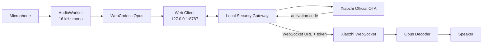
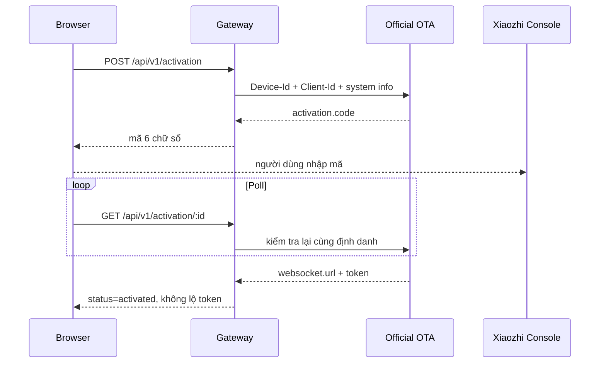
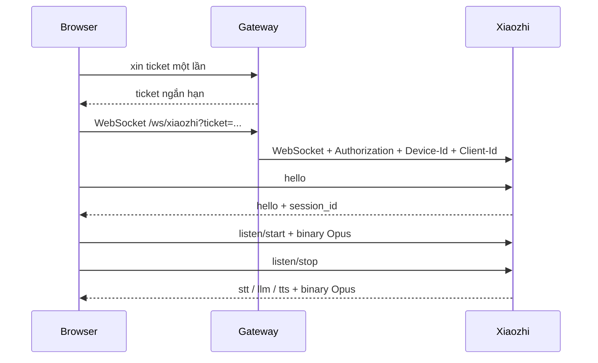

<div align="center">

# 🇻🇳 ViPocket-Xiaozhi 2.3

### Client thoại Xiaozhi cho Windows — tải ZIP, giải nén, nhấp đúp và nhận mã kích hoạt thật

[](https://github.com/Base27-CVNSS/ViPocket-Xiaozhi/releases/download/windows-latest/ViPocket-Xiaozhi-Windows-x64.zip)
[](./package.json)
[](./LICENSE)
[](https://github.com/78/xiaozhi-esp32)

[⬇️ **TẢI WINDOWS PORTABLE**](https://github.com/Base27-CVNSS/ViPocket-Xiaozhi/releases/download/windows-latest/ViPocket-Xiaozhi-Windows-x64.zip)

**[Tiếng Việt](./README.md) · [English](./README.en.md)**

</div>

---

## ⚡ Chạy một phát trên Windows

Bản Windows Portable chứa sẵn Node.js x64, dependency WebSocket, website production, gateway, bộ Start/Stop/Repair và cấu hình dự phòng. Người dùng không cần Git, không cần cài Node.js và không cần gõ `npm install`.

```text
1. Tải ViPocket-Xiaozhi-Windows-x64.zip.
2. Giải nén toàn bộ ZIP.
3. Mở thư mục ViPocket-Xiaozhi.
4. Nhấp đúp START-VIPOCKET.cmd.
5. Trình duyệt tự mở http://127.0.0.1:8787/
6. Nhấn “Yêu cầu mã kích hoạt”.
7. Nhập mã thật vào Xiaozhi Console.
```

> Không chạy trực tiếp bên trong ZIP. Phải giải nén đầy đủ để `runtime`, `node_modules` và website nằm đúng cấu trúc.

### Các tệp Windows

| Tệp | Chức năng |
|---|---|
| `START-VIPOCKET.cmd` | Khởi động website và gateway, tự mở trình duyệt |
| `STOP-VIPOCKET.cmd` | Dừng đúng tiến trình ViPocket |
| `REPAIR-VIPOCKET.cmd` | Cài/build lại khi dùng source ZIP hoặc file bị thiếu |
| `CONFIGURE-XIAOZHI.cmd` | Chỉ dùng khi chuyển sang máy chủ tùy chỉnh |

### Một tiến trình, một cổng

```text
Website + Gateway: http://127.0.0.1:8787/
Health check:      http://127.0.0.1:8787/health
WebSocket proxy:   ws://127.0.0.1:8787/ws/xiaozhi
```

---

## Điểm mới quan trọng của 2.3

### 1. Official Cloud là mặc định, không cần sửa `.env`

Nếu người dùng không khai báo máy chủ riêng, gateway tự chọn OTA chính thức đang được dự án `78/xiaozhi-esp32` sử dụng:

```text
https://api.tenclass.net/xiaozhi/ota/
```

Do đó lỗi cũ:

```text
XIAOZHI_OTA_URL is not configured on the gateway.
```

không còn xuất hiện trong chế độ mặc định.

### 2. Bốn chế độ kết nối rõ ràng

```dotenv
XIAOZHI_MODE=auto
```

| Chế độ | Hành vi |
|---|---|
| `auto` | Ưu tiên WebSocket cố định, sau đó OTA tùy chỉnh; nếu không có thì dùng Official Cloud |
| `official` | Luôn dùng OTA chính thức |
| `custom` | Bắt buộc có OTA riêng hoặc WebSocket + token |
| `offline` | Chỉ chạy giao diện local, không gọi upstream |

### 3. Định danh trình duyệt tương thích thiết bị

ViPocket tạo một địa chỉ MAC cục bộ, unicast và ổn định theo trình duyệt, ví dụ:

```text
02:11:22:33:44:55
```

ID cũ dạng `web-aa:bb:cc:dd:ee:ff` được tự động di chuyển. Phiên activation cũ bị xóa khi định danh thay đổi để tránh poll sai thiết bị.

### 4. Payload OTA gần với firmware thật

Gateway gửi các header:

```http
Activation-Version: 1
Device-Id: <MAC ổn định>
Client-Id: <UUID v4>
Accept-Language: vi-VN
Content-Type: application/json
```

Body chứa cấu trúc tương thích `Board::GetSystemInfoJson()` của upstream: phiên bản, ngôn ngữ, MAC, UUID, chip/browser, application, display và board.

### 5. Xử lý lỗi upstream dễ hiểu

Gateway phân biệt:

- timeout OTA;
- DNS/proxy/tường lửa;
- phản hồi không phải JSON;
- HTTP lỗi;
- phản hồi thành công nhưng không có mã activation hoặc cấu hình WebSocket.

Token trả từ OTA được giữ trong gateway, không ghi vào `localStorage` của trình duyệt.

---

## Kiến trúc



### Luồng activation



### Luồng thoại



---

## Cấu hình nâng cao

### Dùng Official Cloud rõ ràng

```dotenv
XIAOZHI_MODE=official
```

### Dùng OTA riêng

```dotenv
XIAOZHI_MODE=custom
XIAOZHI_OTA_URL=https://your-server.example/ota/
```

### Dùng WebSocket cố định

```dotenv
XIAOZHI_MODE=custom
XIAOZHI_WS_URL=wss://your-server.example/xiaozhi/v1/
XIAOZHI_ACCESS_TOKEN=your-private-token
```

Sau khi thay `.env`:

```text
STOP-VIPOCKET.cmd
START-VIPOCKET.cmd
```

Không commit `.env` hoặc token thật lên GitHub.

---

## Client thoại

- Thu micro qua `getUserMedia()`.
- Echo cancellation, noise suppression và AGC.
- `AudioWorklet` tách xử lý khỏi UI thread.
- Resample 16 kHz mono, frame 60 ms.
- WebCodecs mã hóa/giải mã Opus.
- Push-to-talk bằng chuột, cảm ứng, Space hoặc Enter.
- Xử lý `hello`, `listen`, `abort`, `stt`, `llm`, `tts`, `alert`, `mcp`.
- Ngắt lời dừng phát cục bộ và gửi `abort`.

---

## API gateway

| Phương thức | Endpoint | Chức năng |
|---|---|---|
| `GET` | `/health` | Kiểm tra website/gateway và cấu hình activation |
| `POST` | `/api/v1/activation` | Tạo phiên activation thật |
| `GET` | `/api/v1/activation/:id` | Poll trạng thái liên kết |
| `POST` | `/api/v1/activation/:id/ticket` | Cấp ticket WebSocket một lần |
| `DELETE` | `/api/v1/activation/:id` | Xóa phiên |
| `WS` | `/ws/xiaozhi?ticket=...` | Proxy JSON/binary tới upstream |

---

## Kiểm thử và độ tin cậy

GitHub Actions chỉ phát hành ZIP khi vượt qua:

1. kiểm tra cú pháp JavaScript và PowerShell;
2. unit test session/ticket;
3. unit test Official Cloud là mặc định;
4. unit test header, payload, mã activation và WebSocket sau pairing;
5. Vite production build;
6. smoke test website + gateway trên Linux;
7. đóng gói Node runtime, `ws` và web build;
8. chạy chính launcher Windows đã đóng gói;
9. kiểm tra `/`, `/health` và `activationConfigured=true`;
10. tạo ZIP và cập nhật release `windows-latest`.

Các bài test giao thức dùng upstream giả lập để ổn định và không tạo hàng loạt thiết bị chờ trên dịch vụ công cộng.

---

## Xử lý lỗi

### `ERR_CONNECTION_REFUSED`

```text
STOP-VIPOCKET.cmd
START-VIPOCKET.cmd
```

Xem:

```text
logs\vipocket.log
logs\vipocket-error.log
```

### OTA timeout hoặc không thể kết nối

Kiểm tra Internet, DNS, proxy, VPN và tường lửa. Official Cloud là dịch vụ bên ngoài nên có thể bảo trì hoặc thay đổi chính sách.

### Mã bị Console từ chối

Chỉ dùng mã do màn hình activation của ViPocket 2.3 vừa nhận từ OTA. Không dùng mã cũ, mã tự tạo hoặc mã từ phiên/trình duyệt khác.

---

## Chạy từ mã nguồn

```bash
git clone https://github.com/Base27-CVNSS/ViPocket-Xiaozhi.git
cd ViPocket-Xiaozhi
npm install
npm run build
npm start
```

Kiểm thử:

```bash
npm test
npm run check
```

---

## Bảo mật và giới hạn

- Gateway chỉ bind `127.0.0.1` mặc định.
- Token upstream chỉ nằm trong bộ nhớ gateway.
- Ticket WebSocket ngắn hạn và dùng một lần.
- CORS giới hạn origin local.
- Không công khai gateway nếu chưa có TLS và đăng nhập.
- ViPocket có thể bảo đảm launcher, gateway, payload và protocol adapter; không thể bảo đảm 100% thời gian hoạt động hoặc chính sách của dịch vụ Xiaozhi bên ngoài.

---

## Ghi công và giấy phép

Mã nguồn ViPocket-Xiaozhi phát hành theo [MIT License](./LICENSE).

Dự án độc lập, tham chiếu giao thức và OTA mặc định từ [`78/xiaozhi-esp32`](https://github.com/78/xiaozhi-esp32). ViPocket không thuộc, không đại diện và không được `xiaozhi.me` bảo trợ.
