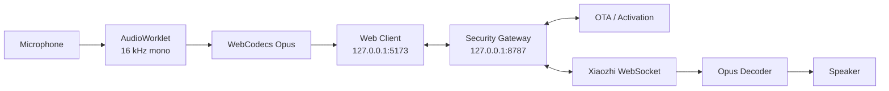
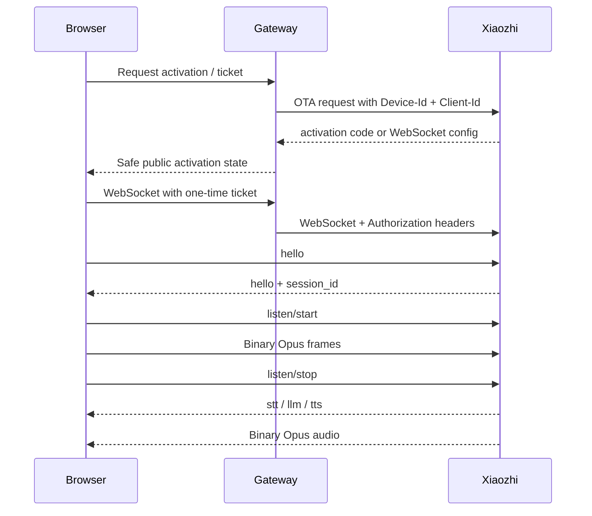

<div align="center">

# 🇻🇳 ViPocket-Xiaozhi 2.1

### Tải về Windows, giải nén, nhấp đúp và chạy ngay

[](../../actions)
[](./package.json)
[](./LICENSE)
[](./docs/PROTOCOL.md)

**[Tiếng Việt](./README.md) · [English](./README.en.md)**

</div>

---

## ⚡ Cách dùng nhanh nhất trên Windows

Bản **Windows Portable** được CI đóng gói sẵn với:

- Node.js portable.
- Dependency runtime của gateway.
- Giao diện web đã build production.
- Launcher, lệnh dừng và lệnh sửa lỗi.

Người dùng không cần cài Git, không cần cài Node.js và không cần tự chạy `npm install`.

```text
1. Tải artifact ViPocket-Xiaozhi-Windows-x64.zip trong GitHub Actions.
2. Giải nén toàn bộ ZIP.
3. Nhấp đúp START-VIPOCKET.cmd.
4. Chờ launcher mở http://127.0.0.1:5173.
```

Các lệnh Windows:

```text
START-VIPOCKET.cmd       Khởi động website và gateway
STOP-VIPOCKET.cmd        Dừng toàn bộ cây tiến trình
REPAIR-VIPOCKET.cmd      Cài/build lại khi bản nguồn bị lỗi
CONFIGURE-XIAOZHI.cmd    Mở cấu hình kết nối Xiaozhi thật
```

Địa chỉ hệ thống:

```text
Website:         http://127.0.0.1:5173
Gateway health:  http://127.0.0.1:8787/health
```

> Cổng `8787` là API gateway, không phải trang giao diện. Launcher chỉ mở trình duyệt sau khi cả website và gateway đã vượt qua kiểm tra sức khỏe.

---

## ViPocket-Xiaozhi là gì?

ViPocket-Xiaozhi là một client thoại Xiaozhi chạy trong Edge/Chrome, đi kèm gateway cục bộ để bảo vệ token và thêm các header WebSocket mà trình duyệt không thể tự đặt.



### Mức hoàn thiện mục tiêu

| Thành phần | Mức | Nội dung |
|---|---:|---|
| Prototype UI | **8/10** | Responsive, Việt–Anh, wizard ba bước, transcript và chẩn đoán |
| Kết nối Xiaozhi | **8/10** | OTA activation, Device-Id, Client-Id, token phía gateway và WebSocket proxy |
| Client thoại | **8/10** | AudioWorklet, WebCodecs Opus, PTT, STT/LLM/TTS và ngắt lời |
| Trải nghiệm Windows | **9/10** | Runtime đóng gói sẵn, health check, tự mở trình duyệt, stop/repair/configure |

---

## Nâng cấp quan trọng trong 2.1

### 1. Windows Portable thật

Workflow Windows tạo ZIP chứa sẵn `runtime/`, `node_modules/` và `apps/web/dist/`. Bản đóng gói không chạy Vite development server và không cần tải dependency ở lần mở đầu tiên.

### 2. Production runner

`scripts/portable-runner.mjs` thực hiện hai nhiệm vụ:

- Phục vụ web production tại cổng `5173` bằng Node.js HTTP server nhẹ.
- Khởi động gateway như tiến trình con tại cổng `8787`.

Runner hỗ trợ:

- MIME `application/wasm`.
- SPA fallback.
- Chặn path traversal.
- Cache dài cho asset có hash.
- `no-store` cho `index.html`.
- Dừng đồng bộ gateway khi runner bị tắt.

### 3. Launcher tự phục hồi

`START-VIPOCKET.cmd` và PowerShell launcher:

- Ưu tiên Node runtime đã đóng gói.
- Dùng Node hệ thống khi phù hợp.
- Tự tải Node LTS portable khi chạy bản source ZIP và máy chưa có Node.
- Chỉ chạy `npm install`/build nếu thiếu dependency hoặc web production.
- Phát hiện xung đột cổng.
- Ghi nhật ký vào `logs/vipocket.log`.
- Lưu PID và dừng toàn bộ cây tiến trình bằng `STOP-VIPOCKET.cmd`.

### 4. Không tạo mã kích hoạt giả

ViPocket chỉ hiển thị mã từ `activation.code` do endpoint OTA/Xiaozhi trả về. Không còn sinh số ngẫu nhiên rồi yêu cầu người dùng nhập vào Console.

---

## Kết nối Xiaozhi thật

Website local có thể khởi động ngay sau khi tải về. Để liên kết với máy chủ Xiaozhi thật, cần endpoint/token mà người triển khai có quyền sử dụng.

Nhấp đúp:

```text
CONFIGURE-XIAOZHI.cmd
```

Sau đó cấu hình một trong hai chế độ.

### Chế độ A — OTA activation

```dotenv
XIAOZHI_OTA_URL=https://your-server.example/ota/
```

Endpoint ban đầu trả mã kích hoạt:

```json
{
  "activation": {
    "code": "668673",
    "message": "Please enter the code",
    "timeout_ms": 300000
  }
}
```

Sau khi liên kết thành công, endpoint trả cấu hình WebSocket:

```json
{
  "websocket": {
    "url": "wss://your-server.example/xiaozhi/v1/",
    "token": "server-issued-token",
    "version": 1
  }
}
```

### Chế độ B — WebSocket cố định

```dotenv
XIAOZHI_WS_URL=wss://your-server.example/xiaozhi/v1/
XIAOZHI_ACCESS_TOKEN=replace-with-server-side-token
```

Sau khi lưu `.env`:

```text
1. Chạy STOP-VIPOCKET.cmd
2. Chạy lại START-VIPOCKET.cmd
```

Không commit `.env` hoặc token thật lên GitHub.

---

## Quy trình hội thoại



Gateway không trả token upstream xuống trình duyệt. Browser chỉ nhận ticket ngắn hạn dùng một lần.

---

## API gateway

| Phương thức | Endpoint | Chức năng |
|---|---|---|
| `GET` | `/health` | Kiểm tra gateway và trạng thái cấu hình |
| `POST` | `/api/v1/activation` | Tạo phiên activation |
| `GET` | `/api/v1/activation/:id` | Poll trạng thái liên kết |
| `POST` | `/api/v1/activation/:id/ticket` | Cấp ticket WebSocket một lần |
| `DELETE` | `/api/v1/activation/:id` | Xóa phiên |
| `WS` | `/ws/xiaozhi?ticket=...` | Proxy JSON/binary với upstream |

---

## Chạy từ mã nguồn

```bash
git clone https://github.com/Base27-CVNSS/ViPocket-Xiaozhi.git
cd ViPocket-Xiaozhi
npm install
npm run build
npm start
```

Chế độ phát triển có hot reload:

```bash
npm run dev
```

Kiểm thử:

```bash
npm test
npm run check
```

---

## Cấu trúc dự án

```text
ViPocket-Xiaozhi/
├─ apps/
│  ├─ web/                    Web voice client
│  └─ gateway/                Activation API + WebSocket proxy
├─ scripts/
│  ├─ portable-runner.mjs     Production runner
│  ├─ windows-one-click.ps1   Windows launcher
│  └─ windows-stop.ps1        Process-tree shutdown
├─ docs/
├─ runtime/                   Có trong Windows artifact
├─ START-VIPOCKET.cmd
├─ STOP-VIPOCKET.cmd
├─ REPAIR-VIPOCKET.cmd
├─ CONFIGURE-XIAOZHI.cmd
├─ .env.example
└─ package.json
```

---

## Xử lý lỗi Windows

### `ERR_CONNECTION_REFUSED`

Website/gateway chưa chạy hoặc cổng bị chiếm:

```text
STOP-VIPOCKET.cmd
START-VIPOCKET.cmd
```

Xem log:

```text
logs\vipocket.log
```

### Gói source thiếu dependency

```text
REPAIR-VIPOCKET.cmd
```

### Gateway chạy nhưng chưa kích hoạt được

Mở:

```text
CONFIGURE-XIAOZHI.cmd
```

và điền endpoint/token hợp lệ. Launcher không thể tự tạo quyền truy cập Xiaozhi thay cho người dùng.

---

## Bảo mật

- Gateway mặc định chỉ bind `127.0.0.1`.
- Token nằm trong `.env` và bộ nhớ gateway.
- CORS dùng allowlist loopback.
- Ticket WebSocket ngẫu nhiên, thời hạn ngắn và dùng một lần.
- Log che các trường token/authorization.
- Không mở gateway ra Internet khi chưa có đăng nhập và TLS.

Xem thêm:

- [Kiến trúc](./docs/ARCHITECTURE.md)
- [Giao thức](./docs/PROTOCOL.md)
- [Bảo mật](./docs/SECURITY.md)
- [Triển khai](./docs/DEPLOYMENT.md)

---

## Giới hạn trung thực

Bản Windows Portable bảo đảm **website và gateway local có thể khởi động mà không cần cài công cụ phát triển**. Việc kết nối thành công đến một máy chủ Xiaozhi cụ thể vẫn phụ thuộc vào:

- Endpoint OTA/WebSocket hợp lệ.
- Token/quyền truy cập hợp lệ.
- Chính sách của máy chủ upstream.
- Trình duyệt hỗ trợ WebCodecs Opus và quyền micro.

Dự án không nhúng token công khai và không giả lập pairing để tạo cảm giác kết nối thành công.

---

## Giấy phép và ghi công

Mã nguồn ViPocket-Xiaozhi được phát hành theo [MIT License](./LICENSE).

Dự án độc lập, tham chiếu giao thức của [`78/xiaozhi-esp32`](https://github.com/78/xiaozhi-esp32), không đại diện và không thuộc `xiaozhi.me` hay tác giả upstream.
