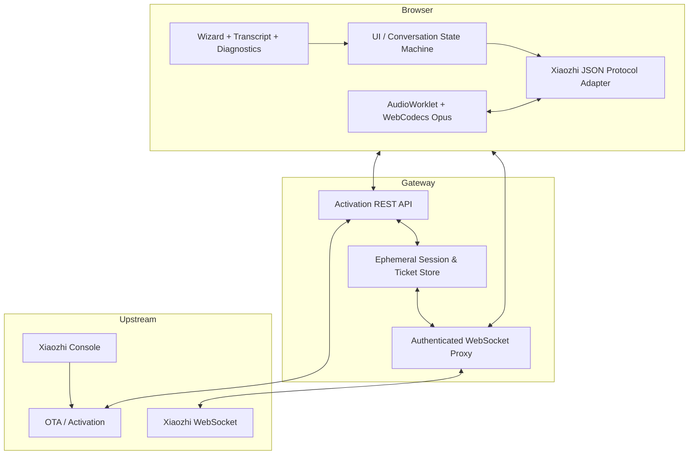
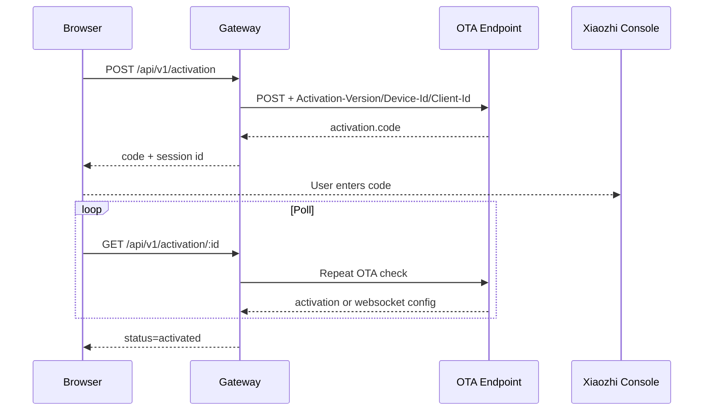
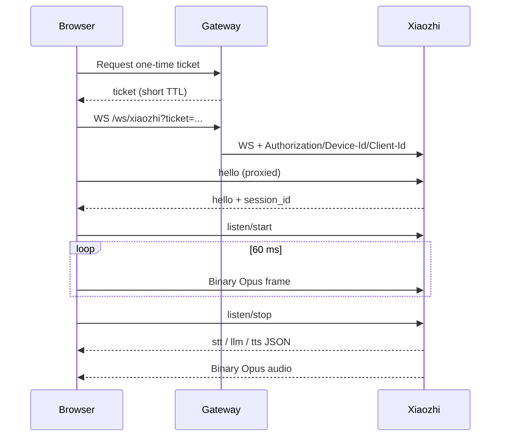

# Kiến trúc / Architecture

## 1. Mục tiêu thiết kế

ViPocket tách trình duyệt khỏi bí mật upstream. Browser chịu trách nhiệm UI và media. Gateway chịu trách nhiệm định danh thiết bị, activation, token và WebSocket handshake headers.

## 2. Các lớp chính

## 3. Activation sequence

## 4. Voice sequence

## 5. Trách nhiệm từng thành phần

### Browser

- Không lưu access token.
- Sinh và giữ định danh browser device.
- Kiểm tra khả năng Secure Context, AudioWorklet và WebCodecs Opus.
- Encode/decode audio.
- Chuyển đổi message protocol thành trạng thái UI.

### Gateway

- Gọi OTA bằng header thiết bị.
- Không trả upstream token về browser.
- Cấp ticket WebSocket dùng một lần.
- Mở upstream WebSocket với header tùy chỉnh.
- Chuyển tiếp text/binary không biến đổi.

### Upstream

- Cấp activation code.
- Gắn thiết bị với tài khoản/agent.
- Cấp WebSocket URL/token.
- Thực hiện ASR, LLM, TTS và MCP tùy cấu hình server.
