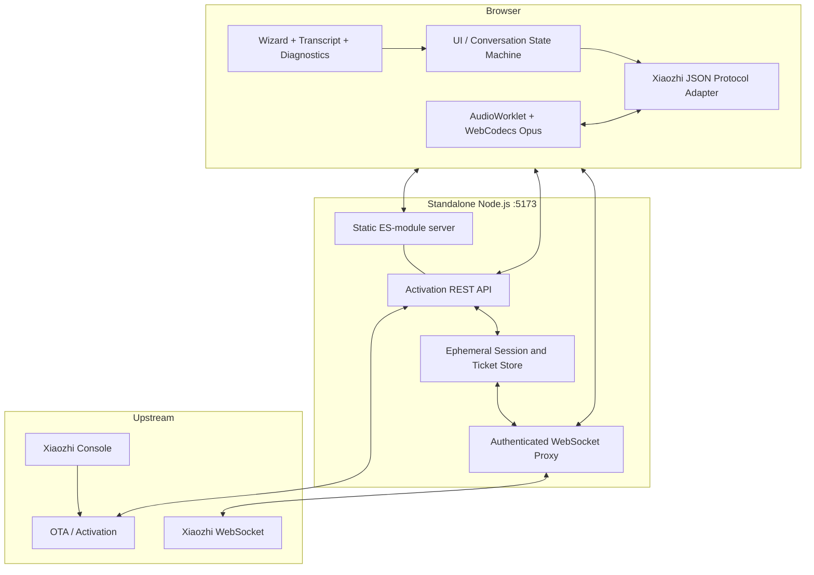
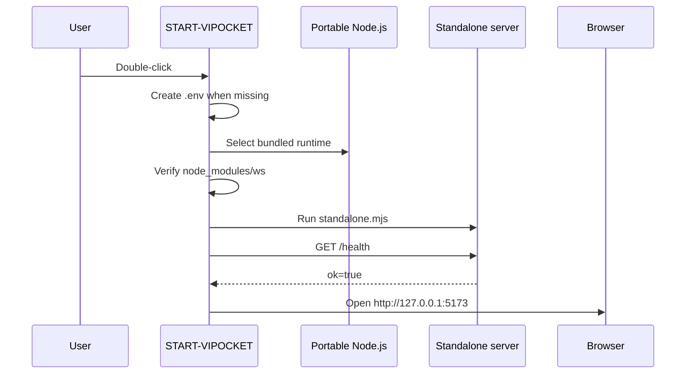
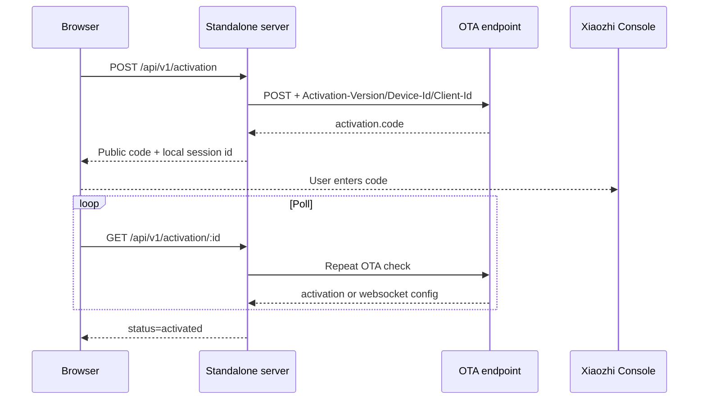
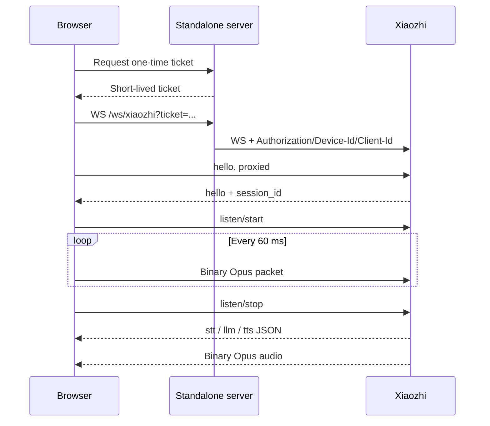

# Kiến trúc / Architecture

## 1. Nguyên tắc thiết kế

ViPocket 2.2 tách bí mật upstream khỏi trình duyệt nhưng **không tách website và gateway thành hai dịch vụ**. Một tiến trình Node.js tại `127.0.0.1:5173` phục vụ đồng thời:

- HTML, CSS và ES modules của web client.
- REST API activation.
- Health API.
- WebSocket proxy Xiaozhi.
- Bộ nhớ session và ticket ngắn hạn.

Điều này loại bỏ CORS nội bộ, cổng `8787`, Vite runtime và việc phối hợp hai tiến trình.

## 2. Các lớp chính

## 3. Khởi động Windows

## 4. Activation sequence

## 5. Voice sequence

## 6. Trách nhiệm

### Browser

- Không nhận hoặc lưu upstream access token.
- Giữ `Device-Id` và `Client-Id` ổn định trong local storage.
- Thu microphone bằng `getUserMedia` và AudioWorklet.
- Mã hóa/giải mã Opus bằng WebCodecs.
- Hiển thị STT, trạng thái TTS, cảm xúc và chẩn đoán.
- Gửi `abort` khi barge-in.

### Standalone server

- Phục vụ web cùng origin.
- Đọc `.env` mà không cần thư viện dotenv.
- Gọi OTA bằng header thiết bị.
- Không trả upstream token về browser.
- Cấp ticket WebSocket ngẫu nhiên, ngắn hạn, dùng một lần.
- Mở upstream WebSocket với header tùy chỉnh.
- Chuyển tiếp text/binary không biến đổi.
- Giới hạn body, WebSocket payload và tần suất API.

### Upstream

- Cấp activation code thật.
- Liên kết thiết bị với tài khoản hoặc agent.
- Cấp WebSocket URL/token.
- Thực hiện ASR, LLM, TTS và MCP theo cấu hình máy chủ.

## 7. Trạng thái được giữ trong RAM

`SessionStore` hiện là bộ nhớ tiến trình:

- Restart làm mất activation session và ticket.
- Ticket bị xóa ngay sau lần sử dụng đầu tiên.
- Session tự hết hạn.

Khi scale nhiều instance, cần Redis hoặc kho dữ liệu chia sẻ có thao tác consume-ticket nguyên tử.
